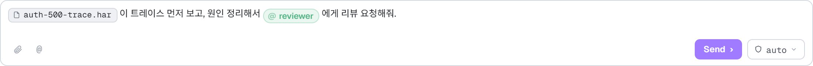
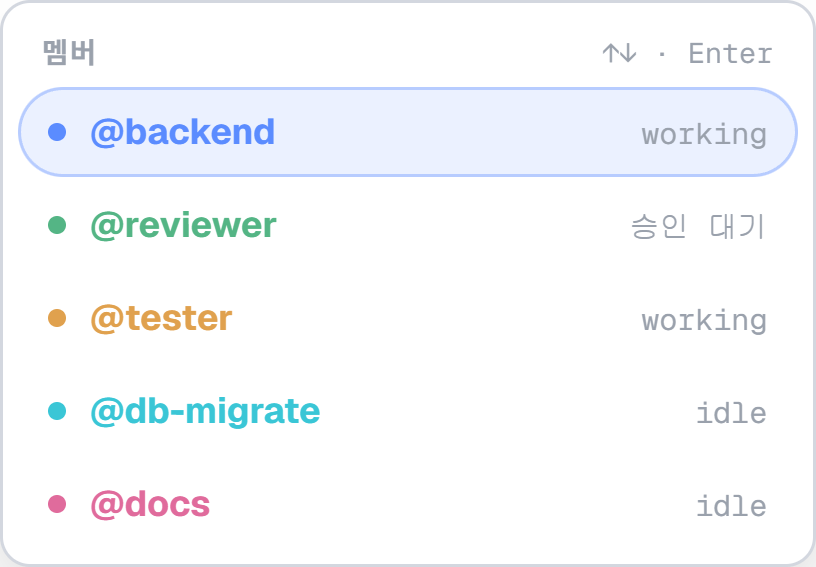
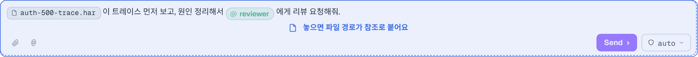
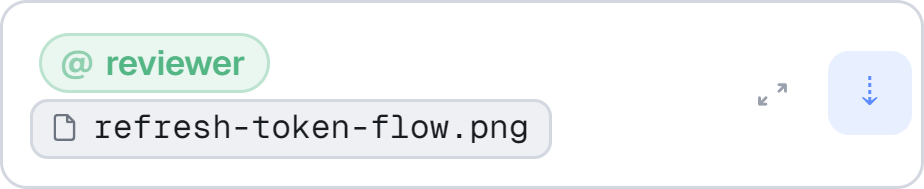
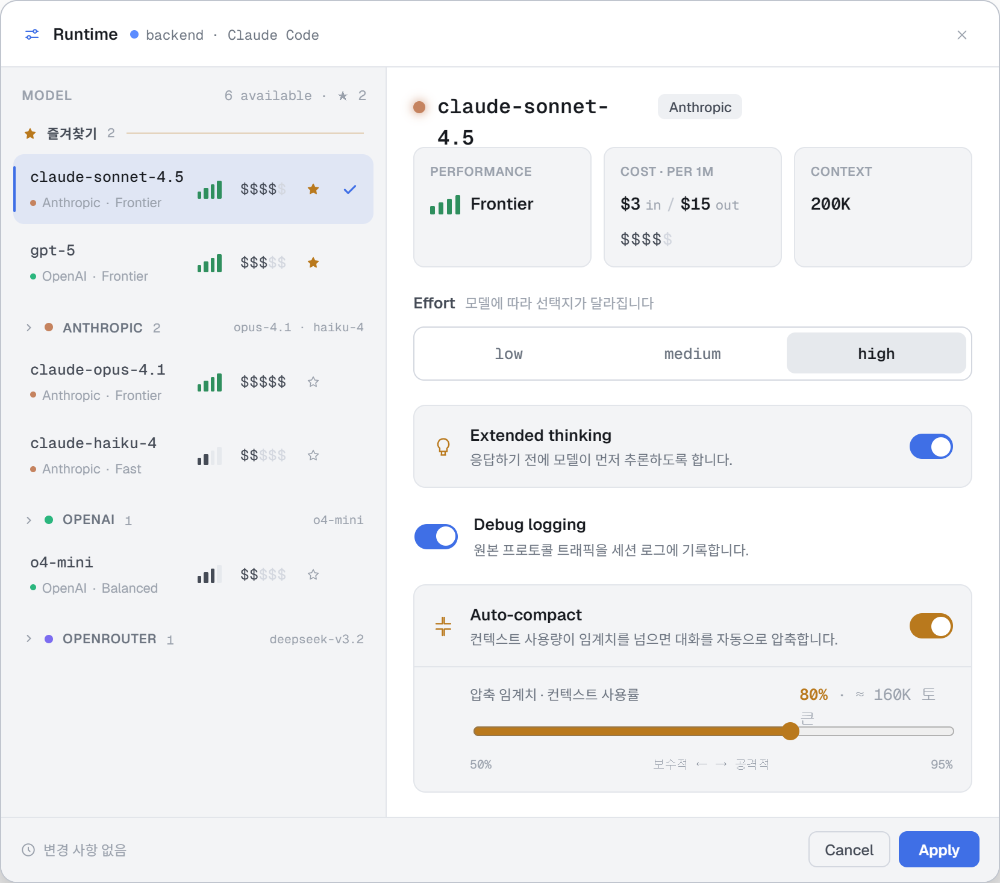
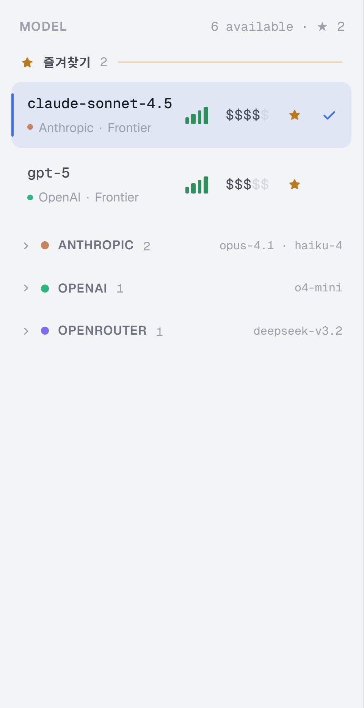
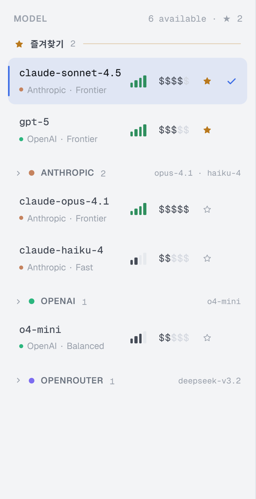

# Handoff: AgentParty — 인라인 멘션/파일 참조 컴포저 & 모델 카탈로그(즐겨찾기·프로바이더 접기)

## 무엇을 만드는가

두 기능이다. 둘 다 **Electron 데스크톱 앱**의 Workbench 화면에 들어간다.

**A. 인라인 멘션/파일 참조 컴포저**
채팅 입력창에서 문장 **중간에** 두 종류의 토큰(칩)을 넣을 수 있다.
- **멤버 멘션** — `@` 입력 → 파티 멤버 자동완성 → 선택 시 캐럿 위치에 멤버 칩.
- **파일 참조** — Finder/탐색기에서 파일을 **입력창으로 드래그 앤 드롭** → 드롭한 지점에 파일 칩.
사람은 "파일명.확장자"만 보고(호버 시 전체 경로), **모델에게는 전체 경로 문자열이 그대로** 간다. 실제 파일 업로드는 없다 — 로컬 경로 참조다.

**B. 모델 카탈로그(Runtime 모달 좌측 목록)**
- **즐겨찾기(★)**: 즐겨찾기된 모델은 프로바이더 그룹에서 **빠져나와** 목록 맨 위 "즐겨찾기" 섹션에 항상 먼저 놓인다.
- **프로바이더 접기**: 프로바이더 그룹은 **기본 접힘**, 헤더 클릭으로 펼침.

Fidelity: **High.** 색/타이포/여백/치수/인터랙션은 확정본이다. 아래 수치는 그대로 구현할 것.

---

## 참고 파일

- `Workbench Multi.dc.html` — 인터랙티브 프로토타입. 브라우저에서 바로 열린다. 상단 우측 시나리오 스위처에서 **`멘션·첨부`** 를 누르면 이 문서의 상태가 재현된다(`좁은 패널`은 narrow 규격 확인용).
- `support.js` — 프로토타입 실행용 런타임. **포팅하지 말 것.**
- `screenshots/` — 각 절에서 참조.

프로토타입에서 직접 만져볼 것: 입력창에 `@` 입력 → 자동완성 → 문장 중간 칩 삽입 → 파일 드래그(또는 📎 버튼으로 대체 삽입) → `Send` → 대화 버블에서 같은 칩으로 보이는지.

> 색 토큰(`--bg-*`, `--text-*`, `--border*`, `--accent*`, `--live*`), 폰트(Geist / Geist Mono), 패널·탭·툴바·Runtime 모달의 기본 규격은 `design_handoff_workbench/README.md`를 따른다. 대기열 규격은 `design_handoff_message_queue/README.md`. 이 문서는 **위 두 기능만** 다룬다.

---

# A. 인라인 멘션/파일 참조 컴포저

## A-1. 컴포저 기본 (wide ≥ 600px)



컴포저 박스: `1px solid var(--border)`, `border-radius:10px`, `background:var(--bg-2)`, `padding:8px 10px`, `:focus-within` 시 보더 `var(--accent-bd)`.
입력 영역은 **`contenteditable="true"` div** 다(textarea 아님 — 인라인 칩이 필요하므로).

```
min-height:38px; outline:none;
font-size:12.5px; line-height:1.6; color:var(--text-0);
white-space:pre-wrap; word-break:break-word;
```

- **플레이스홀더**: 별도 요소. `position:absolute; left:0; top:0; pointer-events:none; font-size:12.5px; line-height:1.6; color:var(--text-3)`. 텍스트는 기존 규칙 유지(`{멤버}에게 메시지 보내기…` / working이면 `{멤버}가 작업 중 — 보내면 대기열에 쌓입니다`). 내용이 비었을 때만 렌더.
- 하단 액션 행은 기존과 동일. 좌측 2개 버튼의 의미가 바뀐다:
  - 📎 (클립) — 파일 참조 추가. Electron에서는 **파일 선택 다이얼로그**(`dialog.showOpenDialog`)를 열고 선택 경로를 칩으로 삽입한다. (프로토타입에서는 드래그를 대신하는 데모용 샘플 경로를 넣는다.)
  - `@` — 캐럿 위치에 `@` 문자를 입력하고 자동완성을 띄운다(터치/마우스 사용자용 진입점).
- **Enter = 전송**, **Shift+Enter = 줄바꿈**. working 상태에서는 전송 대신 대기열 추가(기존 규칙 그대로).

## A-2. 칩 두 종류 — 반드시 시각적으로 구분된다

같은 크기(높이 20px)지만 **형태·서체·색이 다르다.** 멤버는 "사람", 파일은 "코드/자원"이라는 인상을 준다.

**멤버 칩** (pill)

```
display:inline-flex; align-items:center; gap:4px;
height:20px; padding:0 8px 0 7px; border-radius:999px;
background: <멤버색 @12%>;
box-shadow: inset 0 0 0 1px <멤버색 @30%>;
color: <멤버색>;
font-size:11.5px; font-weight:600; letter-spacing:-.1px;
vertical-align:-3px; white-space:nowrap; user-select:none;
```
내용: `<span style="opacity:.6;font-weight:700">@</span>` + 멤버 이름.
`title` = `"{멤버} 멤버를 멘션"`. 멤버색은 기존 멤버 아이덴티티 색(backend `#5b8cff`, frontend `#a07bff`, reviewer `#2fa87a` 등)을 그대로 쓴다.

**파일 칩** (rounded rect)

```
display:inline-flex; align-items:center; gap:4px;
height:20px; padding:0 8px 0 6px; border-radius:6px;
background:var(--bg-3);
box-shadow: inset 0 0 0 1px var(--border);
color:var(--text-0);
font-family:var(--mono); font-size:11px;
vertical-align:-3px; white-space:nowrap; user-select:none;
```
내용: 파일 아이콘(11×11, `stroke:var(--text-2)`, `stroke-width:1.7`, path `M14 3v5h5M14 3H7a2 2 0 0 0-2 2v14a2 2 0 0 0 2 2h10a2 2 0 0 0 2-2V8Z`) + **파일명.확장자만**.
`title` = **전체 경로**(`~/Downloads/auth-500-trace.har` 또는 `/Users/jd/...`). 경로는 칩 위에 노출하지 않는다.

> 칩은 **원자 단위**다: `contenteditable="false"`, `user-select:none`, `cursor:default`. Backspace 한 번에 칩 전체가 지워진다(브라우저 기본 동작). 칩 안쪽 텍스트를 편집할 수 없어야 한다.

## A-3. 멘션 자동완성



**트리거**: 입력 이벤트마다 캐럿 앞 텍스트를 `/@([^\s@\u00a0]*)$/` 로 검사. 매치되면 popover 오픈, 캡처 그룹이 검색어(`q`).
**후보**: 현재 파티 멤버 중 **자기 자신(대화 상대 멤버) 제외**, 이름에 `q` 포함(대소문자 무시), 최대 6개.

Popover (wide):
```
position:absolute; left:0; width:272px; bottom:calc(100% + 6px); z-index:40;
background:var(--bg-2); border:1px solid var(--border); border-radius:10px;
box-shadow:0 18px 44px -16px rgba(0,0,0,.45);
padding:5px; max-height:236px; overflow-y:auto; gap:1px;
```
- 섹션 헤더: 좌측 `멤버` (9.5px/700, uppercase, `letter-spacing:.5px`, `--text-3`), 우측 힌트 `↑↓ · Enter` (mono 9.5px, `--text-3`), `padding:5px 8px 3px`.
- 멤버 행: `height:30px; padding:0 9px; border-radius:999px` — 상태 점 6px(멤버색) · 이름 `@name` (12px/700, 멤버색, 말줄임) · 우측 상태(mono 10px, `--text-3`: `working` / `승인 대기` / `idle`).
- **활성 행**: `background:<멤버색 @12%>`, `border:1px solid <멤버색 @36%>`. 마우스 hover 시에도 활성 인덱스가 이동한다.
- 결과 없음: `일치하는 멤버가 없어요` (11.5px, `--text-3`, `padding:9px`).
- narrow 패널에서는 같은 구조를 축약: `padding:4px`, `border-radius:9px`, `max-height:180px`, 행 `height:27px`, 이름 11.5px, 힌트 줄 생략.

**키보드**: `↓`/`↑` 이동(순환), `Enter`/`Tab` 선택, `Esc` 닫기. popover가 열려 있는 동안 `Enter`는 전송이 아니라 선택이다.
**선택 시**: 캐럿 앞의 `@q` **텍스트를 지우고** 그 자리에 멤버 칩 + NBSP를 넣고 캐럿을 NBSP 뒤로 옮긴다.

> ⚠️ 구현 함정: popover 행은 `mousedown`에서 `preventDefault()` 해야 한다. 그렇지 않으면 클릭 순간 `contenteditable`이 포커스를 잃어 selection이 사라지고 삽입 위치를 잃는다. 보조로 마지막 캐럿(`{node, offset}`)을 저장해 두고 fallback으로 쓴다.

## A-4. 파일 드롭



**드래그 중(dragover)**: 컴포저 박스 보더가 `var(--accent)`로 바뀌고 박스 안에 오버레이가 뜬다.
```
position:absolute; inset:0; border-radius:10px;
background:var(--accent-dim); border:1.5px dashed var(--accent);
display:flex; align-items:center; justify-content:center; gap:8px;
pointer-events:none;
```
파일 아이콘 15px + `놓으면 파일 경로가 참조로 붙어요` (12px/600, `var(--accent)`, `white-space:nowrap`).
narrow: 같은 오버레이, `border-radius:9px`, 문구 `놓으면 경로가 붙어요` (11px/600).

**드롭 처리 순서**
1. `dragenter`/`dragover`에서 `preventDefault()` + `dataTransfer.dropEffect='copy'` (안 하면 Chromium이 파일을 새 창으로 열어버린다). Electron 메인에서 `will-navigate` / `window.open` 차단도 함께 걸어둘 것.
2. 드롭 지점 → 캐럿: `document.caretRangeFromPoint(e.clientX, e.clientY)` (Chromium). 반환 노드가 에디터 밖이면 에디터 끝으로 fallback.
3. 경로 얻기:
   - `e.dataTransfer.files` 가 있으면 각 `File`에 대해 **Electron ≥ 32**에서는 `webUtils.getPathForFile(file)` (구버전의 `File.path`는 제거됨). `contextBridge`로 `getPathForFile`만 노출한다.
   - 없으면 `text/uri-list` → `text/plain` 순으로 읽고 `file://` 접두사를 제거.
4. 파일이 여러 개면 **드롭 순서대로 칩을 연속 삽입**한다.
5. 파일명 = 마지막 `/` 뒤, 디렉터리 = 그 앞. 칩 라벨은 파일명, `title`은 전체 경로.

**⚠️ 필수 클램프**: `caretRangeFromPoint`는 `contenteditable="false"` 칩 **내부 텍스트 노드**를 돌려줄 수 있다. 그대로 `insertNode` 하면 칩이 쪼개져 라벨 중간에 다른 칩이 박히고, 직렬화(§A-6)에서 그 참조가 **조용히 사라진다**. 삽입 직전에 range 시작 노드의 조상을 훑어 `[data-tok]` 또는 `contenteditable="false"` 요소가 있으면 `setStartAfter(칩)` 후 `collapse(true)` 로 옮긴다.

**공백 규칙**: 칩 뒤에는 항상 NBSP(`\u00a0`) 하나. 칩 앞의 형제가 요소이거나 공백으로 끝나지 않는 텍스트면 앞에도 NBSP 하나를 넣는다(칩끼리 붙어 `…har@/Users/…`처럼 보이지 않게).

## A-5. 전송된 메시지


user 버블 내부는 `white-space:pre-wrap` 텍스트 흐름이고, 토큰만 칩으로 렌더한다(형태는 컴포저와 동일, 배경만 버블 대비를 위해 조정):

- 멤버: `height:20px; padding:0 8px 0 7px; border-radius:999px; background:<멤버색 @13%>; box-shadow:inset 0 0 0 1px <멤버색 @34%>; color:<멤버색>; font-size:11.5px; font-weight:600; vertical-align:-3px; white-space:nowrap` + 흐린 `@` + 이름.
- 파일: `height:20px; padding:0 8px 0 6px; border-radius:6px; background:var(--bg-2); box-shadow:inset 0 0 0 1px var(--border); font-family:var(--mono); font-size:11px; color:var(--text-0)` + 파일 아이콘 + 파일명, `title`에 전체 경로.

버블 자체의 규격(최대 90%, `border-radius:9px 9px 3px 9px`, 발신자 라벨/시간, 다른 멤버가 보낸 경우 우측 3px 컬러 엣지)은 기존 규칙 그대로.

**대기열과의 관계**: working 멤버에게 보내면 대기열 항목으로 쌓이고, 참조 목록이 항목에 함께 저장된다. 대기열 행에는 📎+개수 배지(`height:17px; padding:0 6px; radius:4px; bg:var(--bg-3); 1px var(--border); mono 9.5px/700 var(--text-2)`)가 붙는다. 항목의 `편집`(연필)을 누르면 텍스트가 컴포저로 복원되면서 **칩도 함께 복원**된다.

## A-6. 데이터 모델 · 직렬화

에디터 DOM → 값:

```
walk(childNodes):
  textNode        → nodeValue (NBSP를 일반 공백으로 치환)
  el[data-tok]    → el.dataset.tok            // "@backend" 또는 "@/abs/path/file.ts"
                    kind==='file' 이면 refs.push({path, name, dir})
  <br>            → "\n"
  기타 element    → (DIV면 앞에 "\n") 재귀
```

- 칩 DOM에 저장하는 데이터: `data-kind`(`member|file`), `data-tok`(모델에 갈 토큰 문자열), 파일은 `data-name`/`data-dir`, 멤버는 `data-mid`.
- **모델에게 가는 텍스트는 위 walk 결과 그대로**다. 멤버는 `@이름`(파티 내 이름은 유일), 파일은 `@절대경로`. 별도 JSON 첨부 구조를 만들지 않는다 — 단, 프론트 로깅/후처리를 위해 `refs: [{kind:'file', path}]`를 메시지 레코드에 함께 저장한다.
- 초안(draft)은 **멤버 단위 상태**(`drafts[memberId]`, `refs[memberId]`)로 보관한다. 같은 멤버가 여러 패널에 열려 있으면 초안은 공유된다.

## A-7. 구현 함정 (실제로 다 밟았다)

1. **에디터 인스턴스가 여러 개다.** 같은 멤버가 여러 패널에 동시에 열릴 수 있다(`좁은 패널` 시나리오는 한 멤버가 3개). DOM 핸들을 멤버당 1개로 들고 있으면 마지막 마운트만 살아남아 다른 패널에 입력/드롭이 새어 나간다. → 멤버당 **핸들 목록**으로 관리하고, 입력·드롭·삽입·전송은 **이벤트가 발생한 에디터**를 대상으로 한다.
2. **패널 탭을 바꾸면 같은 DOM 노드가 재사용된다.** 그 노드가 이전 멤버 id로도 등록돼 남으면 다른 멤버의 초안이 덮어써진다. → 노드에 `data-owner = memberId`를 각인하고, 소유자가 다른 노드는 목록에서 제거·무시한다. 소유자가 바뀌면 내용을 비우고 새 초안으로 재구성한다.
3. **`contenteditable`은 프레임워크가 다시 그리면 안 된다.** 초안 상태는 값으로 들고 있고, DOM은 직접 조작한다. 프로그램적으로 초안이 바뀐 경우(대기열 편집 복원, 초기 프리셋, 전송 후 비우기)에만 **명시적으로 재구성(rehydrate)** 한다. 재구성 조건은 `노드에 마지막으로 반영한 텍스트 !== 현재 초안`. 포커스가 있던 에디터는 재구성 후 캐럿을 끝으로 복원한다.
4. **붙여넣기**는 plain text로 강제(`paste` 가로채서 `insertText`). 외부 HTML이 들어오면 칩 규격이 깨진다.
5. IME(한글) 조합 중에는 자동완성 트리거를 막지 않아도 되지만, `Enter` 전송은 `isComposing` 중이면 무시할 것.

## A-8. narrow 패널 (< 408px)



- 컴포저는 1행 형태를 유지하되 입력 영역이 `contenteditable`이라 **칩이 여러 줄로 흐른다**(`min-height:28px; padding:4px 0`). 박스는 `border-radius:9px; padding:3px 3px 3px 9px`.
- 플레이스홀더는 `{멤버}에게…`, `height:28px` 안에서 수직 중앙.
- 자동완성 popover는 축약형(§A-3), 드롭 오버레이도 축약형(§A-4).
- 우측 확대 버튼과 전송 버튼은 기존 규격 유지.

---

# B. 모델 카탈로그

## B-1. 전체 (Runtime 모달)



좌측 목록(320px)만 바뀐다. 우측 상세/Effort/토글/Auto-compact 영역은 기존 그대로.
헤더 우측 카운트: `{전체 모델 수} available · ★ {즐겨찾기 수}` (mono 11px, `--text-3`, `nowrap`). 즐겨찾기가 없으면 `★ n` 부분을 생략.

## B-2. 기본 상태 — 즐겨찾기 먼저, 프로바이더는 접힘



**즐겨찾기 섹션** (항상 최상단, 항상 펼침, 즐겨찾기가 1개 이상일 때만 렌더)
- 헤더: `padding:5px 8px 6px` — 채워진 별 12px(`fill/stroke: var(--live)`), 라벨 `즐겨찾기` (11px/700, uppercase, `letter-spacing:.4px`, `--text-1`, `nowrap`), 개수(mono 10.5px, `--text-3`), 그 뒤 `flex:1` 의 `1px` 라인 `var(--live-bd)`.
- **즐겨찾기된 모델은 프로바이더 그룹에서 제거된다**(중복 노출하지 않는다). 그래서 프로바이더 헤더의 개수는 "남은 모델 수"다.

**프로바이더 그룹 헤더** = 버튼
```
display:flex; align-items:center; gap:8px; width:100%;
padding:6px 8px; border-radius:7px; background:transparent;
hover: background:var(--bg-3);
```
- caret 10px chevron, `stroke:var(--text-3)`, `stroke-width:2.4`, `transform: rotate(0deg)` → 펼침 시 `rotate(90deg)`, `transition:transform .15s`.
- 프로바이더 점 7px(프로바이더 색: Anthropic `#c5835f`, OpenAI `#2bb67e`, OpenRouter `#7c6cf0`).
- 이름 11px/600 uppercase `letter-spacing:.4px` `--text-2` `nowrap`, 개수 mono 10.5px `--text-3`.
- 현재 선택된 모델이 **접힌 그룹 안에** 있으면 `사용 중` 배지: `height:15px; padding:0 5px; radius:4px; background:var(--accent-dim); color:var(--accent); 9.5px/700`.
- 우측: 모델명 미리보기(mono 10px, `--text-3`, 우측 정렬, 말줄임) — 최대 3개, `claude-` 접두사 제거, `·` 로 연결, 더 있으면 `…`.

## B-3. 펼친 상태 · 모델 행



모델 행은 기존 규격(높이/여백/선택 시 `--accent-dim` 배경 + 좌측 2px 바 + 우측 체크)에 두 가지가 추가된다.

1. **부제 줄에 프로바이더 표기**: `점 5px(프로바이더 색) + "{Provider} · {Tier}"` (11px, `--text-3`). 즐겨찾기 섹션은 프로바이더 밖에 있으므로 여기서 출처를 읽을 수 있어야 한다.
2. **별 버튼**: 성능/비용 미터 다음, 체크 앞. `24×24; border-radius:6px; background:transparent; hover: var(--bg-4)`.
   별 아이콘 14px, `stroke-width:1.6` — 즐겨찾기 ON = `fill/stroke: var(--live)`, OFF = `fill:none; stroke:var(--text-3)`.
   `title`: `즐겨찾기에 추가` / `즐겨찾기 해제`.
   ⚠️ 별 클릭은 **행 선택으로 전파되면 안 된다** (`stopPropagation`).

## B-4. 동작 규칙

- 즐겨찾기 토글은 **즉시 반영**(모달의 Apply와 무관 — 목록 정리는 설정 변경이 아니다). 앱 전역에 영구 저장(`electron-store` 등). 저장 키는 모델 `id`.
- 즐겨찾기 정렬은 **모델 카탈로그 원본 순서**를 유지한다(별을 누른 시간순 아님) — 목록이 튀지 않게.
- 프로바이더 펼침 상태는 `Record<provider, boolean>`, **기본 false(접힘)**. 세션 유지면 충분하다.
- 모달을 열 때 **현재 모델의 프로바이더를 자동으로 펼친다.** 단, 현재 모델이 즐겨찾기라면 이미 위에 보이므로 아무 그룹도 펼치지 않는다.
- 즐겨찾기를 해제하면 그 모델은 원래 프로바이더 그룹으로 돌아간다(그 그룹이 접혀 있으면 사라진 것처럼 보이므로, 해제한 모델이 현재 선택 모델이면 해당 그룹을 펼쳐준다).
- 모델 수가 늘어나면(OpenRouter 다수) 목록은 세로 스크롤. 즐겨찾기 섹션은 스크롤 컨테이너 안 최상단에 있고 sticky는 아니다.

---

## 스크린샷 인덱스

| 파일 | 내용 |
|---|---|
| `01-composer-chips.png` | wide 컴포저 — 파일 칩 + 멤버 칩이 문장 중간에 인라인 |
| `02-mention-popover.png` | `@` 자동완성 popover (활성 행 강조, 상태 표기, 키 힌트) |
| `03-drop-target.png` | 파일 dragover 상태 — 점선 accent 오버레이 |
| `04-sent-bubble.png` | 전송된 user 버블 안의 칩 렌더 |
| `05-catalog-collapsed.png` | 카탈로그 기본 — 즐겨찾기 2개 + 프로바이더 3개 접힘(미리보기) |
| `06-catalog-expanded.png` | Anthropic·OpenAI 펼침 — 별 OFF 상태 행 포함 |
| `07-runtime-modal.png` | Runtime 모달 전체(좌측 목록 문맥) |
| `08-narrow-composer.png` | narrow 패널 컴포저 — 칩 2개가 흐른 상태 |

## QA 체크리스트

- [ ] 문장 **중간** 클릭 후 `@` → 자동완성 → 선택 시 그 자리에 칩이 들어가고 `@q` 텍스트가 남지 않는다.
- [ ] 자동완성 행을 **마우스로 클릭**해도(포커스 이동) 삽입 위치가 유지된다.
- [ ] 파일을 **기존 칩 위에** 드롭해도 칩이 쪼개지지 않고 그 뒤에 삽입된다.
- [ ] 파일 여러 개 드롭 → 순서대로 칩 n개.
- [ ] 파일 칩은 파일명만, 호버 시 전체 경로 tooltip.
- [ ] 전송 후 버블에 칩이 같은 형태로 남고, 컴포저는 비워진다.
- [ ] working 멤버 → 대기열에 참조가 함께 쌓이고, `편집` 복원 시 칩까지 복원된다.
- [ ] 같은 멤버를 2개 이상 패널에 열고 한쪽에 입력 → 다른 쪽에도 같은 초안/칩이 반영되고, 드롭/전송이 엉뚱한 패널로 가지 않는다.
- [ ] 패널 탭을 다른 멤버로 바꿔도 이전 멤버의 초안이 새 멤버 입력창에 나타나지 않는다.
- [ ] 카탈로그: 별 클릭이 모델 선택을 바꾸지 않는다.
- [ ] 카탈로그: 즐겨찾기된 모델은 프로바이더 그룹에 중복 노출되지 않고, 개수 표기가 남은 수와 일치한다.
- [ ] 모달 재오픈 시 현재 모델의 프로바이더가 펼쳐져 있다(즐겨찾기면 전부 접힘).
