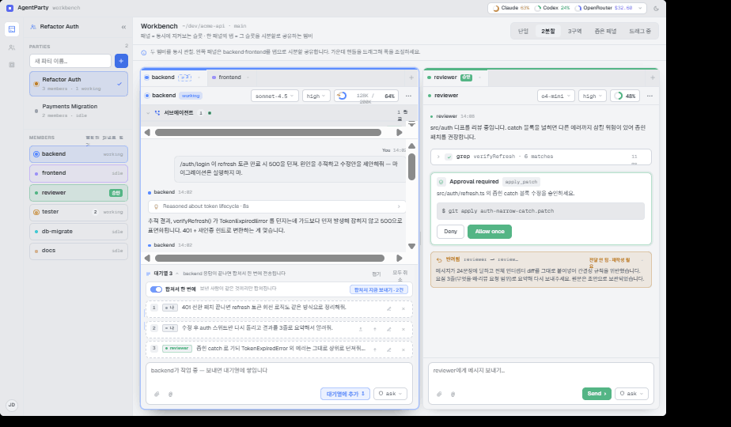
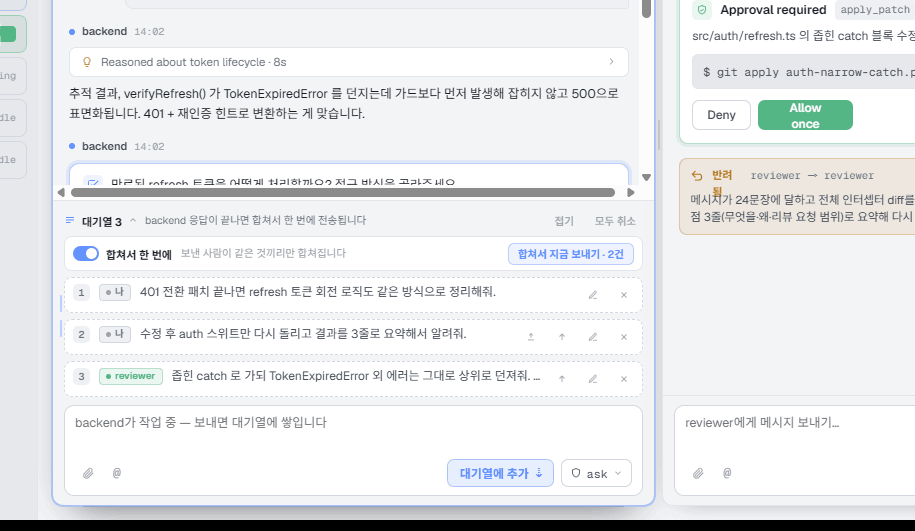
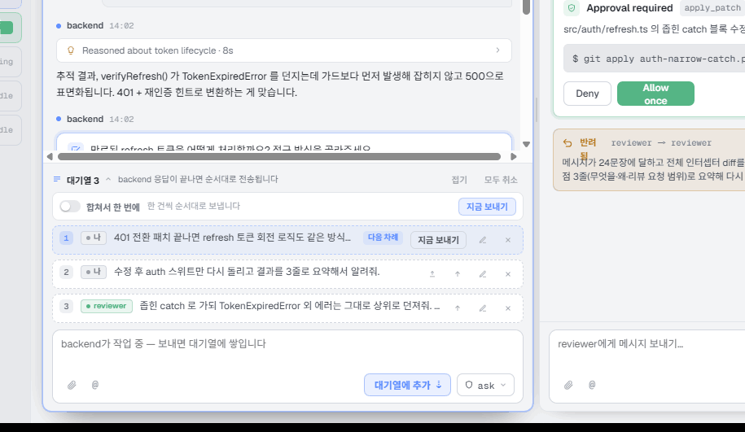
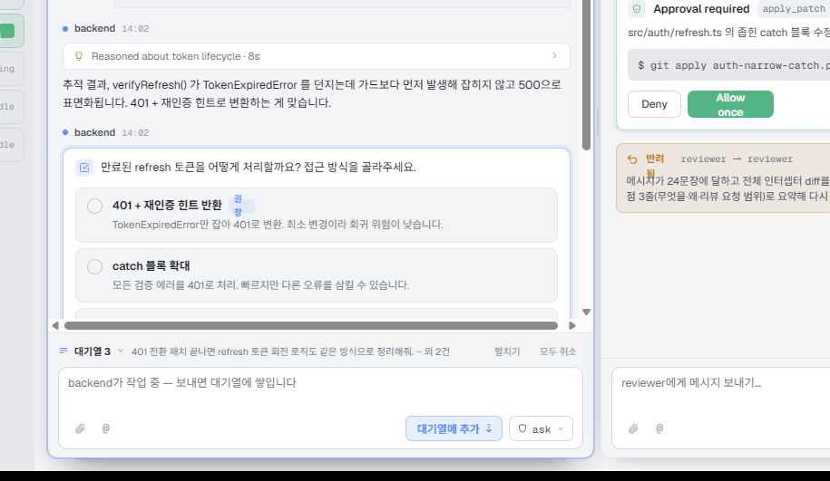
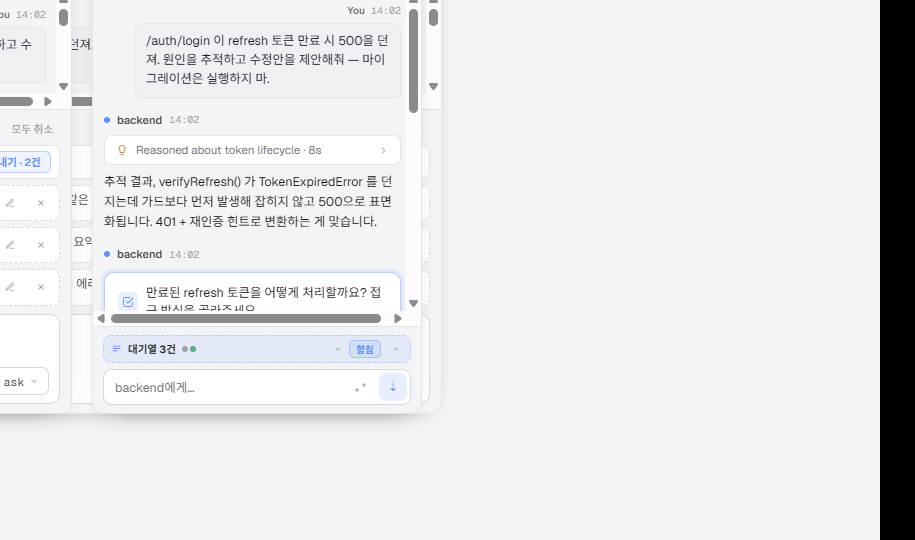
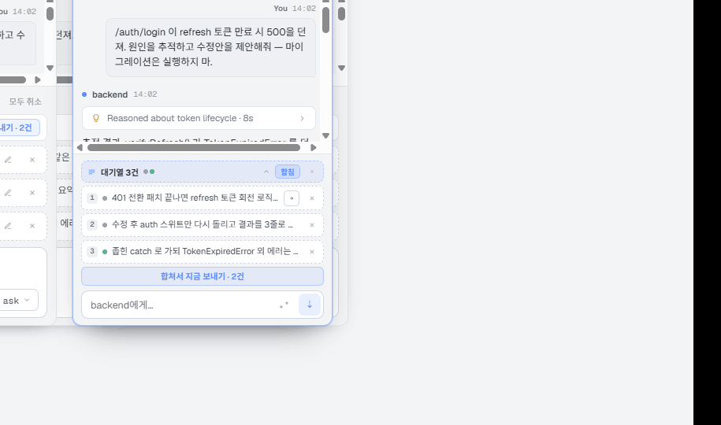
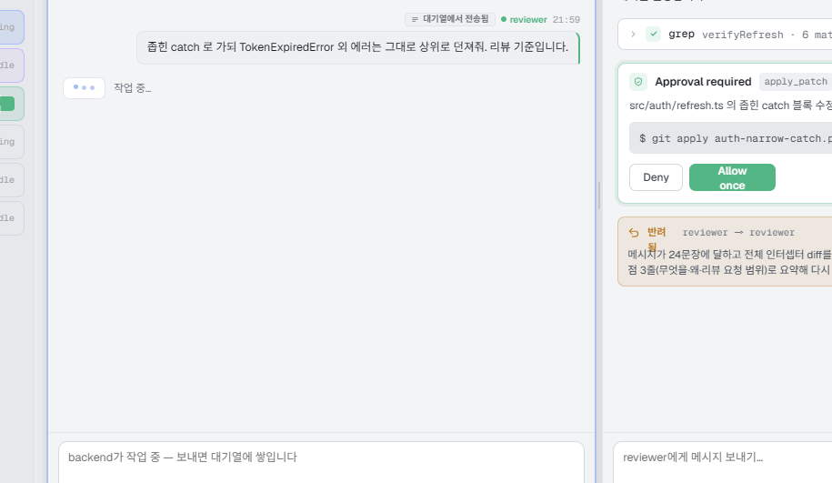
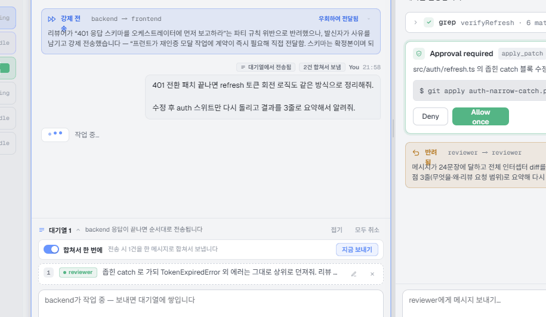
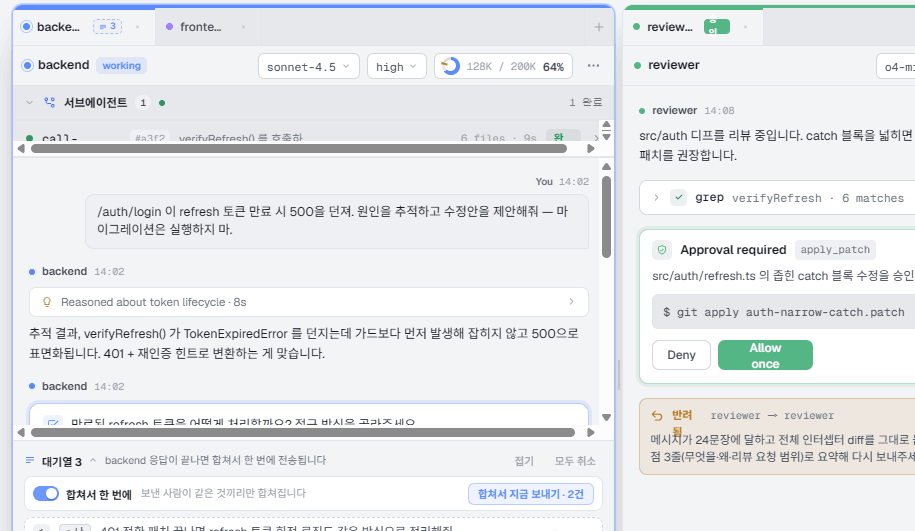

# Handoff: AgentParty — 메시지 대기열 (Message Queue) & 합치기

## 무엇을 만드는가
AgentParty Workbench에서 **멤버가 작업 중일 때 들어온 입력은 대화창(transcript)에 바로 들어가지 않는다.**
컴포저 바로 위의 **대기열(queue)** 에 시각적으로 쌓이고, **실제로 dequeue되어 에이전트에게 전달되는 순간에만** 대화창에 user 블록으로 들어간다.

해결하는 문제 3가지:
1. **보낸 것 같지만 아직 안 간 메시지**가 대화창에 섞여 순서를 오해하게 만드는 문제 → 대기열은 대화창 밖(컴포저 영역)에 산다.
2. 사람들은 보통 **여러 줄을 한 번에** 보내고 싶어함 → 기본값이 **"합쳐서 한 번에 전송"**. 대기열 전체가 한 메시지로 합쳐져 나간다.
3. 대기열에는 **사용자 입력뿐 아니라 다른 멤버(에이전트)가 보낸 메시지**도 들어온다 → 항목마다 **보낸 사람 칩**으로 구분하고, **보낸 사람이 같은 것끼리만** 합쳐진다.

Fidelity: **High.** 색/타이포/여백/인터랙션은 확정본. 대상은 **Electron 데스크톱 앱**.

---

## 참고 파일
- `Workbench Multi.dc.html` — 인터랙티브 프로토타입 (브라우저에서 바로 열림). 상단 우측 시나리오 스위처(`단일 / 2분할 / 3구역 / 좁은 패널 / 드래그 중`)로 밀도별 상태 확인.
- `support.js` — 프로토타입 실행용 런타임. **포팅하지 말 것.**
- `screenshots/` — 아래 각 절에서 참조.

프로토타입에서 직접 만져볼 것: 컴포저에 텍스트 입력 → `대기열에 추가 ⇣` → 항목 정렬/합치기/편집/삭제 → `합쳐서 지금 보내기` → 대화창에 어떻게 들어가는지.

> 기존 Workbench 전반(패널·탭·툴바·Runtime 모달 등)의 규격은 `design_handoff_workbench/README.md`를 그대로 따른다. 이 문서는 **대기열 기능만** 다룬다.

---

## 1. 전체 배치 — 대기열은 컴포저의 일부다



- 대기열은 **transcript 아래 · 컴포저 위**, 컴포저와 같은 `border-top` 블록 안에 산다. 스크롤되지 않고 **항상 보인다**(transcript가 대신 줄어듦).
- 패널마다(=멤버마다) 자기 대기열을 가진다. 탭으로 가려진 멤버의 대기열은 **탭의 뱃지**로만 표시된다(§6).
- 멤버가 **작업 중(working)** 이면 컴포저 Send 버튼이 `대기열에 추가 ⇣` 로 바뀐다. **Stop은 패널 툴바에 그대로 있다** (Send 자리를 Stop이 뺏지 않는다).
- 유휴 상태에서 보내면 대기열을 거치지 않고 바로 대화창으로 간다.

---

## 2. 대기열 해부 (wide ≥ 600px)



세로 3단 구성:

**(a) 헤더 행** — `≡` 아이콘(멤버 컬러) · `대기열 N` (11px/700, `nowrap`) · caret · 상태 문구(`backend 응답이 끝나면 합쳐서 한 번에 전송됩니다`, 10.5px `--text-2`, 말줄임) · 우측 `접기` · `모두 취소`(hover 시 danger).

**(b) 합치기 행** — 카드(`--bg-2`, `1px --border-subtle`, r8) 안에:
- **토글** 26×15, knob 11px, on = 멤버 컬러 / off = `--bg-4`. 라벨 `합쳐서 한 번에`(nowrap).
- 보조 문구: on·동일 발신자 = `전송 시 N건을 한 메시지로 합쳐서 보냅니다` / on·발신자 혼재 = `보낸 사람이 같은 것끼리만 합쳐집니다` / off = `한 건씩 순서대로 보냅니다`.
- 우측 **`합쳐서 지금 보내기 · N건`** 버튼 (`--dim` 배경 + `@.34` 보더 + 멤버 컬러 텍스트). off이거나 합칠 게 1건이면 라벨은 `지금 보내기`.

**(c) 항목 행** (각 `1px dashed` 보더, r8):
`[순번 17×17 mono] [보낸사람 칩] [본문 1줄 말줄임] … [다음 차례] [지금 보내기] [위와 합치기] [위로] [편집] [삭제]`
- 순번/행 강조: 합치기 **off**일 때만 1번 행이 멤버 컬러로 강조(`bg @.07`, `bd @.34`, 번호 `@.18`). on이면 전 항목 동등(어차피 한 덩어리로 나가므로).
- 합치기 **on**이면 합쳐질 연속 구간 왼쪽에 **2px 세로 레일**(`@.34`)이 붙어 "이만큼이 한 메시지"임을 보여준다. 첫 행은 50% 지점에서 시작, 마지막 행은 50%에서 끝.
- 본문 클릭 = **펼치기/접기** (`nowrap+ellipsis` ↔ `pre-wrap`). 합쳐진 긴 메시지 확인용.
- 아이콘 버튼 22×22, `--text-3` → hover 시 `--bg-3`/멤버컬러(삭제는 danger).

---

## 3. 합치기 규칙 (핵심 로직)

- **기본 ON.** 멤버별로 기억한다(`queueMerge[memberId]`, 미설정 시 전역 기본 `true`).
- **자동 합침 대상은 "선두 연속 구간"**: 대기열 맨 앞부터 **보낸 사람이 동일한 연속 항목**까지. 발신자가 바뀌면 거기서 끊긴다.
  예) `[나, 나, reviewer]` → 전송 시 앞의 2건만 합쳐 1건으로 보내고 reviewer 건은 대기열에 남는다.
- **수동 합치기**
  - `위와 합치기`(⬆ 아이콘): 바로 위 항목과 텍스트를 `\n\n`으로 결합. **발신자가 같을 때만 노출.**
  - `모두 합치기`는 별도 버튼이 아니라 "합쳐서 지금 보내기"로 흡수(같은 발신자 구간 단위).
- **합쳐진 본문**은 항목 사이 **빈 줄 1개(`\n\n`)** 로 연결. 원문 순서 보존, 어떤 가공(요약/번호매기기)도 하지 않는다.
- 합치기 **OFF**: 한 건씩 순서대로 전달. 1번 항목에 `다음 차례` 뱃지가 붙는다.



---

## 4. 접기



- `접기`를 누르면 대기열은 **한 줄**로 축소: `≡ 대기열 3 ⌄  <첫 메시지 미리보기> ··· 외 2건   [펼치기] [모두 취소]`.
- 미리보기 텍스트 자체가 버튼(클릭 = 펼치기).
- 접힌 만큼 transcript가 즉시 되찾는다. 상태는 멤버별로 저장.
- **기본값**: wide/mid = 펼침, **narrow = 접힘**(§5).

---

## 5. 좁은 패널(narrow < 408px) 규격




좁은 패널에서는 **대기열이 기본 접힘**이고, 칩 하나로 요약된다.

**접힌 칩** (`1px dashed` 멤버 컬러 `@.34`, 배경 `@.10`, r8, 높이 ~26px):
`≡  대기열 3건  ●●(발신자 색 점 최대 3개)  ⌄   [합침|개별 pill]  [×]`
- 발신자 점은 **중복 제거 후 등장 순서**로 최대 3개. 사용자는 `--text-3`, 멤버는 멤버 컬러.
- `합침 / 개별` pill = 합치기 토글의 축약형(18px, on이면 멤버 컬러 tint).
- `×` = 모두 취소.

**펼친 상태**: 칩 아래에 초경량 행이 쌓인다.
`[순번 14×14] [발신자 색 점 6px] [본문 1줄 말줄임] [▶ 지금 보내기(1번만, 20×20)] [× 삭제]`
- narrow에서는 **위로·위와 합치기·편집 버튼을 숨긴다** (터치/폭 확보). 순서 조정이 필요하면 패널을 넓히거나 삭제 후 재입력.
- 목록 하단에 **폭 100% `합쳐서 지금 보내기 · N건`** 버튼(24px).
- 본문 탭 = 펼치기/접기(전문 확인).

mid(408–599px)는 wide와 동일 구성이되 `다음 차례` 뱃지를 숨기고 `지금 보내기`는 텍스트 버튼을 유지한다.

| 요소 | wide ≥600 | mid 408–599 | narrow <408 |
|---|---|---|---|
| 헤더 + 합치기 행 | 2행 | 2행 | 1행 칩으로 통합 |
| 기본 상태 | 펼침 | 펼침 | 접힘 |
| `다음 차례` 뱃지 | ○ | ✕ | ✕ |
| 지금 보내기 | 텍스트 버튼 | 텍스트 버튼 | ▶ 아이콘(1번 항목만) |
| 위로 / 위와 합치기 / 편집 | ○ | ○ | ✕ |
| 삭제 | ○ | ○ | ○ |

---

## 6. 다른 멤버가 보낸 메시지 (발신자 구분)

대기열 항목의 출처는 두 종류다.
- **사용자** — 칩 `● 나` (배경 `--bg-3`, 보더 `--border`, 텍스트 `--text-2`, 점 `--text-3`)
- **다른 멤버** — 칩 `● reviewer` (배경 멤버컬러 `@.12`, 보더 `@.34`, 텍스트·점 = 그 멤버의 채널 컬러)

칩은 순번 바로 뒤, 본문 앞에 온다(§2 스크린샷의 3번 항목). narrow에서는 칩 대신 **6px 점**만 남긴다.
발신자가 다르면 **합쳐지지 않는다**(§3) — 레일도 끊기므로 "여기부터 다른 사람"이 한눈에 보인다.

dequeue되어 대화창에 들어간 뒤에도 출처가 유지된다:



- 메타 행: `[≡ 대기열에서 전송됨] [N건 합쳐서 보냄] ● reviewer 21:59` — 사용자 발신이면 이름 자리에 `You`.
- 버블: 기존 user 버블과 동일하되 **오른쪽 모서리에 3px 멤버 컬러 엣지**를 준다(사용자 발신은 기존 1px `--border-subtle` 유지).
- 본문은 `white-space: pre-wrap` — 합쳐진 문단 구분이 살아 있어야 한다.

---

## 7. dequeue되어 대화창에 들어가는 순간



전달 시점에만 대화창에 삽입한다. 삽입되는 것은:
1. **user 블록** (`fromQueue: true`, `queuedN`, `from`) — 위 메타 뱃지 포함
2. 그 뒤에 **typing 블록**(작업 중… 점 3개)

트리거 3가지:
- **자동**: 멤버가 응답을 마치고 idle이 되는 순간, 선두 구간을 꺼내 전송(합치기 설정 적용).
- **`합쳐서 지금 보내기 · N건`**: 작업 중이어도 선두 동일 발신자 구간을 즉시 전송.
- **항목의 `지금 보내기`**: 그 한 건만 즉시 전송.

`대기열에서 전송됨` 뱃지는 **영구 표시**(스크롤백에서도 "이건 큐를 거쳐 늦게 들어간 메시지"임을 알 수 있어야 한다).

---

## 8. 탭 뱃지 (가려진 멤버의 대기열)



- 탭 안, `승인`/unread 뱃지 뒤에 `≡ N` 뱃지: 높이 15px, `--bg-3` 배경, **1px dashed 멤버컬러 `@.45`**, 텍스트 = 멤버 컬러, mono 9px.
- dashed는 대기열 UI 전반의 공통 언어("아직 전달되지 않음")다. 실선 = 이미 반영된 것, 점선 = 대기 중.
- tooltip: `대기열 3건 — 응답 완료 후 순서대로 전송`.

---

## 9. 상태 모델 (제안)

```ts
type QueueItem = {
  id: string
  text: string
  from: MemberId | null      // null = 사용자
  at: number                 // enqueue 시각
}

queues:        Record<MemberId, QueueItem[]>
queueMerge:    Record<MemberId, boolean>   // 미설정 시 전역 기본 true
queueCollapsed:Record<MemberId, boolean>   // 미설정 시 narrow=true, 그 외 false
queueOpenItem: Record<string, boolean>     // `${memberId}:${itemId}` 본문 펼침
drafts:        Record<MemberId, string>    // 컴포저 텍스트(편집 되돌리기가 여기로 넣는다)
```

동작:
- `submit(member)` → working이면 `enqueue`, 아니면 즉시 전송.
- `enqueue` → 항상 **끝에** 추가.
- `leadRun(member)` → 맨 앞부터 `from`이 같은 연속 구간.
- `dequeueAllMerged` → `leadRun`을 `\n\n`으로 합쳐 1건 전송.
- `dequeue(id)` → 해당 1건만 전송.
- `mergeUp(id)` → 이전 항목과 결합(같은 `from`일 때만).
- `edit(id)` → 큐에서 제거하고 텍스트를 `drafts[member]` 뒤에 붙임(기존 draft가 있으면 개행으로 연결).
- `move(id, ±1)` / `remove(id)` / `clear(member)`.
- 에이전트가 idle로 전이 → 큐가 비어 있지 않으면 자동 dequeue.

---

## 10. 모션 & 마이크로 인터랙션
- 접기/펼치기, 토글 knob, caret 회전: **.15s**.
- 항목 추가: 아래에서 4px 슬라이드 + fade-in(120ms). 삭제: fade-out + 높이 축소(120ms).
- dequeue: 항목이 **대화창 쪽(위)으로 6px 이동하며 사라지고**, 동시에 user 버블이 fade-in. "큐에서 대화로 옮겨갔다"는 인과를 보여줄 것.
- 합치기 토글 ON: 레일이 위→아래로 그려지듯 나타남(150ms).

## 11. Electron 구현 노트
- **키보드**: `Enter` = 전송/대기열 추가, `Shift+Enter` = 줄바꿈, `Cmd/Ctrl+Enter` = 대기 무시하고 `지금 보내기`, 컴포저가 빈 상태에서 `↑` = 마지막 대기열 항목을 편집으로 되돌리기.
- **영속성**: 대기열은 앱 재시작/세션 재시작에도 살아남아야 한다(멤버별 저장). 재시작 후에도 dequeue 조건은 동일.
- 에이전트 프로세스가 죽거나 재시작되면 대기열은 **유지하고**, 헤더 문구를 `세션 재시작 대기 중`으로 바꾼다(전송하지 않음).
- **멤버→멤버 메시지**도 동일한 큐를 통과한다. 라우팅/게이트(파티 규칙 심사)를 통과한 메시지가 대상 멤버가 작업 중이면 큐에 적재된다 — 게이트에서 반려된 메시지는 큐에 넣지 않는다.
- 큐 길이 상한(예: 20)과 초과 시 헤더 경고 문구는 구현 시 정책으로 정할 것.
- 접근성: 각 항목은 `role="listitem"`, 대기열 컨테이너는 `aria-live="polite"`로 "대기열에 추가됨"을 읽어준다.

## 12. 스크린샷 인덱스
| 파일 | 내용 |
|---|---|
| `01-queue-default.png` | 전체 화면 · 2분할 · backend 패널에 대기열 3건 |
| `02-queue-anatomy.png` | 대기열 확대 (헤더 / 합치기 행 / 항목 3종 + 합침 레일) |
| `03-merge-off.png` | 합치기 OFF — `다음 차례` 뱃지 + 건별 전송 |
| `04-collapsed.png` | 접힌 한 줄 상태 |
| `05-dequeued-merged.png` | 2건 합쳐 전송된 직후 대화창(뱃지 + pre-wrap 본문 + typing) |
| `06-narrow-collapsed.png` | 좁은 패널 기본(접힌 칩 + 발신자 점 + 합침 pill) |
| `07-narrow-expanded.png` | 좁은 패널 펼침(경량 행 + 전체폭 전송 버튼) |
| `09-member-origin-dequeued.png` | 멤버(reviewer) 발신 메시지가 대화창에 들어간 모습 |
| `08-tab-badge.png` | 탭의 `≡ 3` 대기열 뱃지 |
