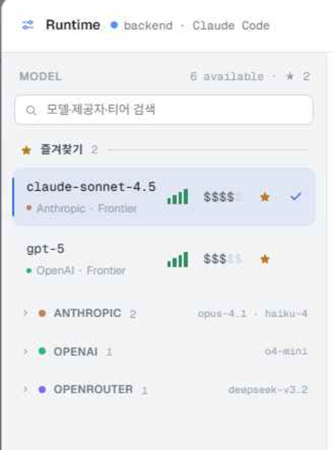
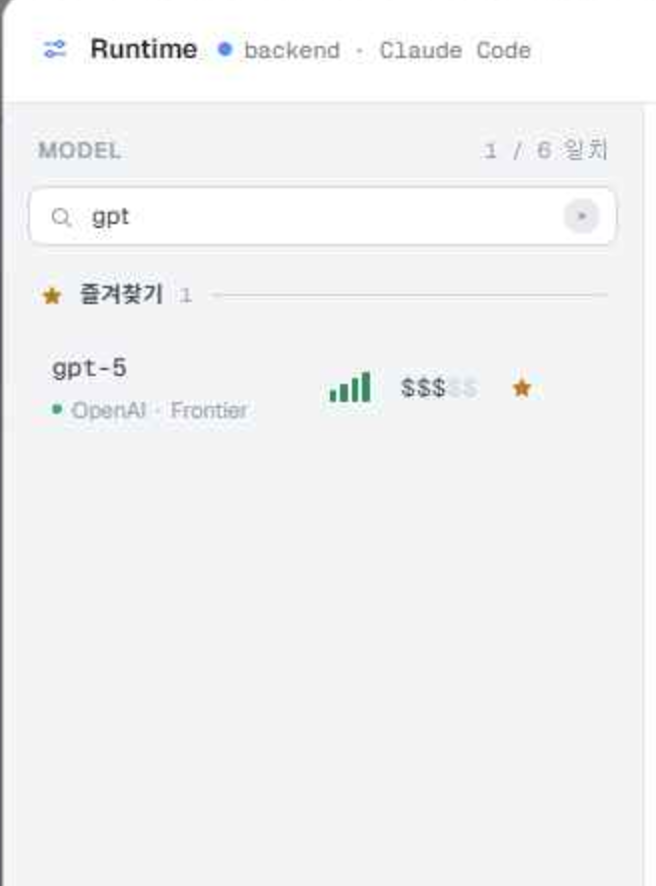
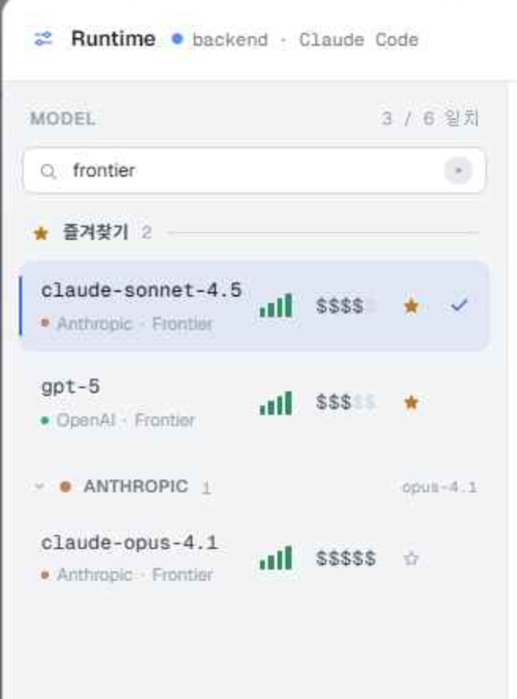
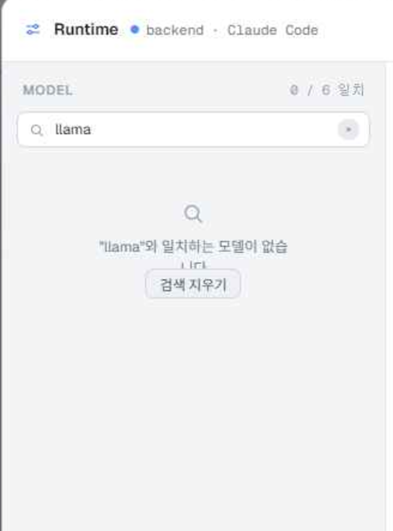

# Handoff: AgentParty — 모델 카탈로그 검색(Runtime 모달)

## 무엇을 만드는가

**Electron 데스크톱 앱**의 Runtime(모델 설정) 모달 좌측 **MODEL 카탈로그**에 **인크리멘털 검색 필드**를 넣는다.

- 헤더 바로 아래, 목록 위에 검색 입력 1개.
- 입력 즉시(디바운스 없음) 목록이 필터링된다. 매칭 대상은 **모델명 + 프로바이더 + 티어** 세 필드의 연결 문자열이다.
- 검색 중에는 **모든 프로바이더 그룹이 강제로 펼쳐진다**(접혀 있어서 결과가 안 보이는 상황 방지).
- 헤더 우측 카운트가 `6 available · ★ 2` → `1 / 6 일치` 로 바뀐다.
- 결과 0건이면 목록 자리에 빈 상태(empty state)를 그린다.

Fidelity: **High.** 아래의 색·치수·문구·동작은 확정본이다. 그대로 구현할 것.

---

## 참고 파일

- `Workbench Multi.dc.html` — 인터랙티브 프로토타입. 브라우저에서 바로 열린다. 아무 패널의 **모델 칩(헤더의 `claude-sonnet-4.5` 버튼)** 을 누르면 Runtime 모달이 열리고 이 문서의 상태가 재현된다.
- `support.js` — 프로토타입 실행용 런타임. **포팅하지 말 것.**
- `screenshots/` — 각 절에서 참조.

> 색 토큰(`--bg-*`, `--text-*`, `--border*`, `--accent*`, `--live*`), 폰트(Geist / Geist Mono), Runtime 모달의 기본 규격(830px 폭, 좌 328px 목록 / 우 상세 2열)은 `design_handoff_workbench/README.md`를 따른다. 즐겨찾기(★)·프로바이더 접기 규격은 `design_handoff_mentions_catalog/README.md` B절을 따른다. **이 문서는 검색 기능만** 다룬다.

---

## 1. 배치 — 카탈로그 컬럼의 3단 구조



좌측 컬럼(폭 328px)은 위에서 아래로 **고정 헤더 / 고정 검색 행 / 스크롤 목록** 3단이다. 검색 행은 **스크롤 영역 밖**에 있다 — 목록을 내려도 검색창은 항상 보인다.

```
[컬럼] display:flex; flex-direction:column; min-height:0

  1) 헤더        flex:none   — "MODEL" · 우측 카운트   (기존)
  2) 검색 행      flex:none   — padding:0 12px 11px     (신규)
  3) 목록        flex:1; min-height:0; overflow-y:auto;
                 padding:0 10px 12px; gap:11px         (기존)
```

검색 행을 헤더에 합치지 말 것. 헤더의 `MODEL` 라벨/카운트는 자기 행을 유지한다.

---

## 2. 검색 입력 필드


**래퍼(div)**

```
display:flex; align-items:center; gap:7px;
height:30px;
padding:0 8px 0 9px;
background:var(--bg-2);
border:1px solid var(--border);
border-radius:8px;
```

**포커스 상태**: 보더만 `var(--accent)` 로 바뀐다. **글로우/링/그림자 없음.**
구현 주의 — `:focus-within` CSS가 아니라 입력의 `focus`/`blur` 이벤트로 상태를 들고 래퍼 보더 색을 바꿨다(프로토타입 런타임 제약). 실제 Electron 구현에서는 `:focus-within`으로 해도 결과가 같으면 무방하다.

**돋보기 아이콘** (좌측, `flex:none`)

```
13×13 svg, fill:none, stroke:var(--text-3), stroke-width:1.9
<circle cx=11 cy=11 r=6.5 />
<path d="M16 16l4.5 4.5" stroke-linecap="round" />
```

**input**

```
flex:1; min-width:0;
background:transparent; border:none; outline:none;
font-family:var(--sans); font-size:12px; color:var(--text-0);
placeholder: "모델·제공자·티어 검색"   (색 var(--text-3))
```

placeholder 문구는 그대로 쓴다 — 이름 말고도 프로바이더·티어로 찾을 수 있다는 걸 알리는 유일한 힌트다.

**클리어 버튼** — 입력값이 비어 있지 않을 때만 렌더된다.

```
width:18px; height:18px; border-radius:50%;
background:var(--bg-4); border:none;
color:var(--text-2);   hover → color:var(--text-0)
아이콘: 10×10 svg, stroke:currentColor, stroke-width:2.4, X 두 path, stroke-linecap:round
title="검색 지우기"
```

---

## 3. 필터링 규칙

```js
const q = query.trim().toLowerCase();
const match = q
  ? models.filter(m => `${m.name} ${m.provider} ${m.tier}`.toLowerCase().includes(q))
  : models;
```

- **대소문자 무시**, 부분 문자열 포함(`includes`) — 퍼지 매칭·정규식 아님.
- 공백만 입력한 경우(`trim()` 후 빈 문자열)는 **검색하지 않은 것**으로 취급한다.
- 필터는 **표시**만 바꾼다. 선택 모델·즐겨찾기 상태는 절대 변경하지 않는다. 현재 선택된 모델이 필터에서 빠져도 우측 상세 패널은 그대로 그 모델을 보여준다(선택 해제 금지).

### 그룹화 — 필터 이후에 수행한다

순서가 중요하다. `필터 → 즐겨찾기 분리 → 프로바이더 그룹핑`.

1. 매칭 결과 중 `fav === true` 인 것들이 목록 **맨 위 "즐겨찾기" 섹션**으로 간다(항상 펼침).
2. 나머지는 프로바이더별 그룹으로 묶는다.
3. 매칭 0건인 프로바이더 그룹은 **헤더째로 렌더하지 않는다.** 빈 그룹을 남기지 말 것.
4. 그룹 헤더의 카운트(`ANTHROPIC 2`)와 접힌 상태 미리보기 텍스트(`opus-4.1 · haiku-4`)는 **필터된 개수**를 반영한다.

### 검색 중 자동 펼침

```js
const open = q ? true : !!provOpen[m.provider];
```

검색어가 있는 동안 프로바이더 그룹은 **전부 펼쳐진 상태로 렌더**된다. 이때 사용자가 눌러 둔 접기/펼치기 상태(`provOpen`)는 **덮어쓰지 않는다** — 검색어를 지우면 원래 접힘 상태로 정확히 되돌아온다.

---

## 4. 헤더 카운트

| 상태 | 문구 |
|---|---|
| 검색 없음 | `6 available · ★ 2` (즐겨찾기 0개면 `· ★ n` 생략) |
| 검색 중 | `1 / 6 일치` |

`{매칭수} / {전체수} 일치`. 스타일은 기존 그대로: `font-size:11px; color:var(--text-3); font-family:var(--mono); white-space:nowrap`.

---

## 5. 상태별 화면

### 5-1. 이름 매칭 — `gpt`



`gpt-5` 하나만 남는다. 이 모델은 즐겨찾기이므로 프로바이더 그룹이 아니라 **즐겨찾기 섹션** 아래에 뜨고, 섹션 카운트는 `1`이 된다. 남은 프로바이더 그룹(ANTHROPIC / OPENAI / OPENROUTER)은 매칭이 없으므로 전부 사라진다.

### 5-2. 티어·프로바이더 매칭 — `frontier`



이름에 없는 단어로도 잡힌다. 즐겨찾기 2개(`claude-sonnet-4.5`, `gpt-5`)가 위에, 나머지 매칭인 `claude-opus-4.1`이 **자동으로 펼쳐진** `ANTHROPIC 1` 그룹 안에 뜬다. 그룹 헤더 우측 미리보기 텍스트도 `opus-4.1` 하나만 표시한다.

### 5-3. 결과 없음 — `llama`



스크롤 목록 자리에 빈 상태를 그린다. 그룹은 하나도 렌더하지 않는다.

```
[래퍼] display:flex; flex-direction:column; align-items:center; gap:9px;
       padding:34px 16px; text-align:center

  아이콘  20×20 돋보기 svg, stroke:var(--text-3), stroke-width:1.6
  문구    font-size:12px; color:var(--text-2); text-wrap:pretty
          "llama"와 일치하는 모델이 없습니다     ← 큰따옴표 포함, 원본 입력값(trim만) 그대로
  버튼    height:25px; padding:0 11px;
          background:var(--bg-3); border:1px solid var(--border); border-radius:7px;
          font-size:11.5px; color:var(--text-1);
          hover → background:var(--bg-4); color:var(--text-0)
          라벨 "검색 지우기"
```

문구에 넣는 검색어는 **소문자화하지 않은 원본**을 쓴다(사용자가 친 그대로 보여야 한다).

---

## 6. 인터랙션 / 키보드

| 동작 | 결과 |
|---|---|
| 타이핑 | 즉시 필터(디바운스 없음). 6~50개 규모 목록이라 debounce 불필요. |
| `Esc` | 검색어를 지운다. **모달은 닫지 않는다** — `stopPropagation()` 필수. 이미 비어 있으면 이벤트를 흘려보내 모달이 닫히게 해도 된다. |
| 클리어 버튼 / 빈 상태 버튼 | 검색어를 `''` 로 초기화. 포커스는 입력으로 되돌린다. |
| 모달 열기 | `modelQuery` 를 항상 `''` 로 리셋한다. 이전 검색어가 남아 있으면 안 된다. |
| 모달 닫기 / Apply / Cancel | 별도 처리 불필요(열 때 리셋되므로). |
| 결과 행 클릭 | 기존 선택 동작 그대로. 선택해도 검색어는 유지된다(연달아 비교할 수 있게). |

**포커스**: 모달이 열릴 때 검색창에 자동 포커스는 **하지 않는다**. 카탈로그는 "훑어보는" 화면이 기본이고, 자동 포커스는 키보드 사용자의 목록 탐색을 방해한다. Electron에서 `Cmd/Ctrl+F`를 모달 스코프에 바인딩해 검색창 포커스로 연결하는 건 권장한다(선택).

**접근성**: input에 `aria-label="모델 검색"`, 목록 컨테이너에 `aria-live="polite"` 를 붙여 매칭 개수 변화를 읽어 준다. 클리어 버튼은 `aria-label="검색 지우기"`.

---

## 7. 상태 모델

기존 Runtime 상태에 문자열 하나만 추가된다.

```
modelQuery: string   // 기본 ''. 모달 open 시 '' 로 리셋. 영속화하지 않는다.
mqFocus:    boolean  // 검색창 포커스 보더용 (CSS :focus-within 으로 대체 가능)
```

`provOpen`(프로바이더 접힘), `favModels`(즐겨찾기), `runtime.selModel`(선택)은 **손대지 않는다.**

---

## 8. 체크리스트

- [ ] 검색 행이 스크롤 영역 밖에 고정되어 있다.
- [ ] 이름·프로바이더·티어 모두로 매칭된다(`frontier`, `openai` 로 검증).
- [ ] 검색 중 프로바이더 그룹이 자동 펼침되고, 검색어를 지우면 원래 접힘 상태로 복원된다.
- [ ] 매칭 0건인 프로바이더 그룹 헤더가 남아 있지 않다.
- [ ] 그룹 카운트/미리보기 텍스트가 필터된 개수를 반영한다.
- [ ] 헤더 카운트가 `n / m 일치` 로 전환된다.
- [ ] 클리어 버튼이 입력값이 있을 때만 나타난다.
- [ ] `Esc` 가 모달을 닫지 않고 검색어만 지운다.
- [ ] 모달을 다시 열면 검색어가 비어 있다.
- [ ] 필터가 선택 모델을 바꾸지 않는다(선택 모델이 필터에서 빠져도 우측 상세 유지).
- [ ] 빈 상태 문구에 사용자가 입력한 원본 대소문자가 그대로 나온다.
