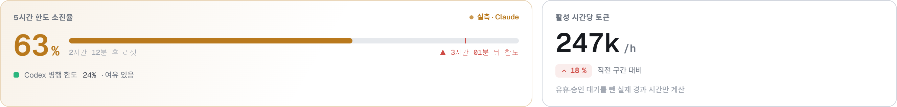
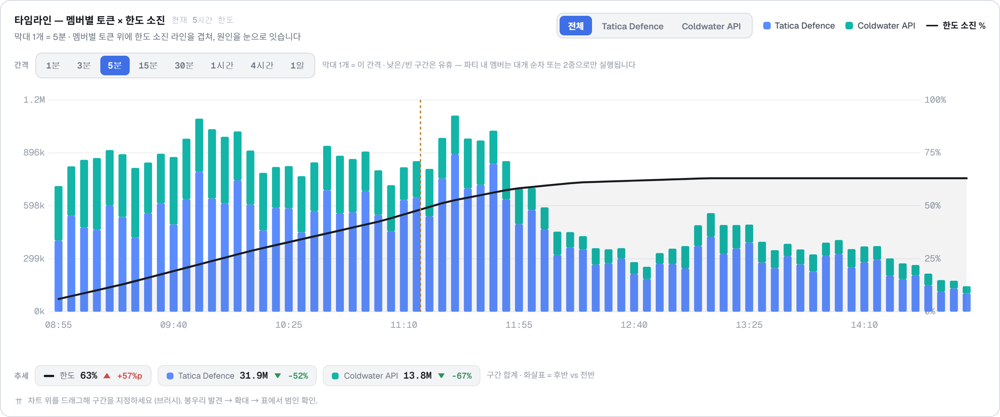
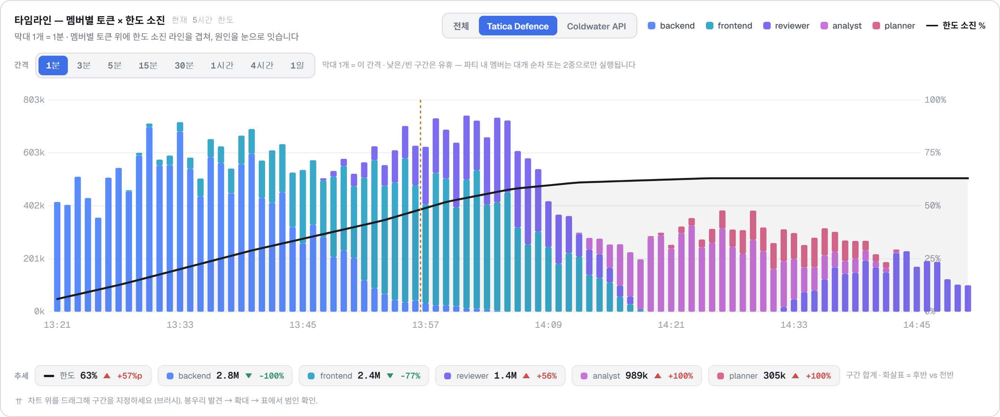
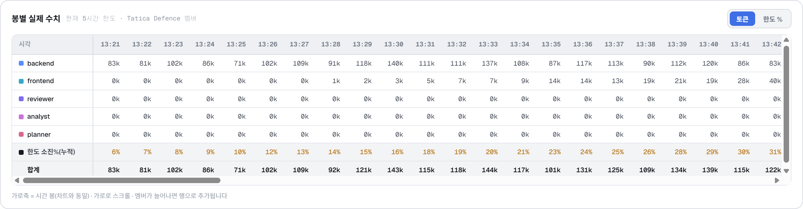
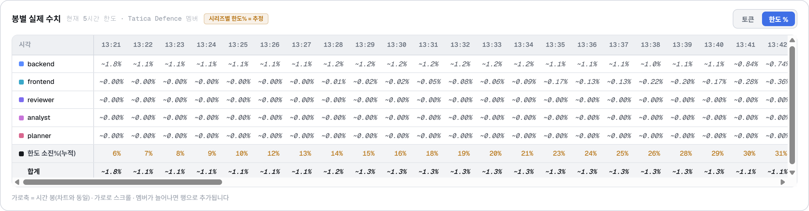
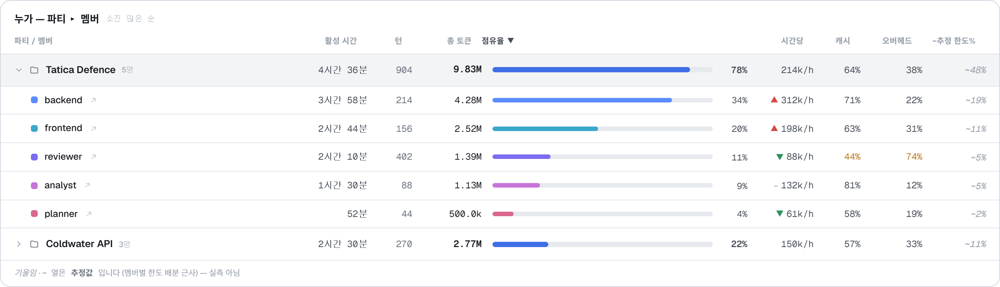
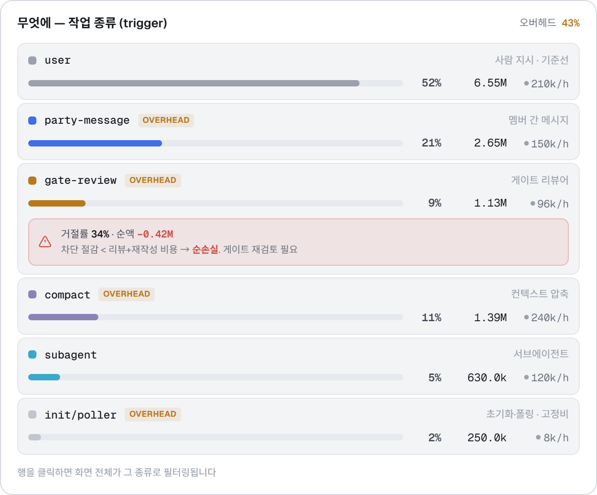
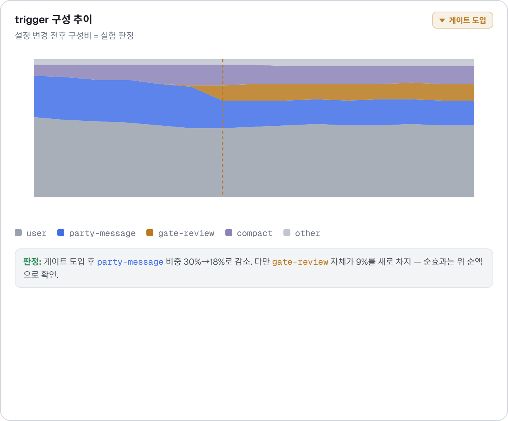
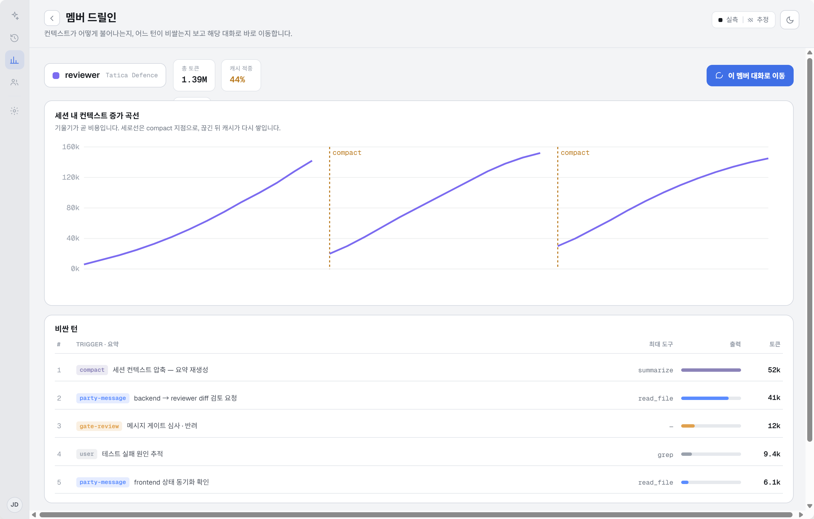
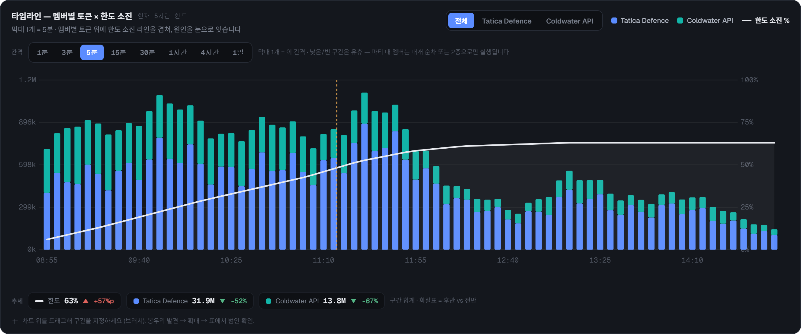

# Handoff: Token Usage (토큰 사용량 통계)

AgentParty 워크벤치에 추가되는 **토큰 사용량 대시보드**. 계정/구독 한도가 왜 이렇게 빨리
소진되는지를 **파티 · 멤버 · 작업 종류(trigger)** 로 분해해 보여주고, 하네스를 바꾼 실험이
효과가 있었는지 **판정**하게 하는 화면이다.

> 이 기능의 존재 이유(한 문장): **전역 계량기(구독 한도 창)는 보이는데, 그것을 만든
> 지역 행위자(파티·멤버·작업 종류)가 안 보인다** — 그 간극을 메운다.

---

## 0. 이 번들에 대하여 (개발자 필독)

- 이 폴더의 `Token Usage.dc.html`(프로젝트 루트에 위치)은 **HTML로 만든 디자인 레퍼런스**다.
  의도한 룩앤필과 인터랙션을 보여주는 프로토타입이지, **그대로 복붙할 프로덕션 코드가 아니다.**
- 작업은 이 UI를 **Electron 앱의 기존 렌더러 환경(React/Vue/vanilla)과 컴포넌트·스타일
  패턴에 맞춰 네이티브로 재구현**하는 것이다. 레퍼런스는 사내 소형 템플릿 런타임(`support.js`)을
  쓰는데, 그 런타임은 **무시**하고 마크업/로직만 옮긴다.
- 레퍼런스의 숫자·차트 데이터는 **전부 하드코딩된 샘플**이다. 실제 값은 계측 계층에서 온다
  (§9 데이터 & 통합 참조). 이 기능은 **데이터 수집 계층부터 새로 만든다** — 이 디자인이
  "무엇을 수집할지"를 역으로 정의한다.

## 1. 충실도(Fidelity)

**하이파이.** 색·타이포·간격·인터랙션은 아래 스펙과 스크린샷을 충실히 맞춘다.
유일하게 목(mock)인 것은 **데이터**다.

디자인 과정에서 확정된 두 가지 **제품 결정**:
1. **"실효 병렬도" 헤드라인 카드는 뺐다.** 파티 안에서 멤버가 전부 동시에 도는 경우는
   드물다(대개 1명, 가끔 2명). 병렬도를 단일 수치로 강조하면 오해를 준다. 대신 타임라인
   차트에서 스택이 겹치는 정도로 자연스럽게 드러난다.
2. **유휴(idle)를 1급 개념으로 반영했다.** 파티 내 멤버는 대개 **순차(핸드오프)**로 돌고
   가끔만 2중으로 겹친다. 활동 없는 구간은 **0 = 유휴**로 그려 빈 막대로 남긴다
   (0을 지어내지 않는다).

---

## 2. 화면 구성 (Screens / Views)

두 개의 최상위 뷰: **대시보드**와 **멤버 드릴인**. 다크/라이트 양쪽 성립(라이트 기본).

### 2.1 헤드라인 — 상단 2개 카드


위→아래 위계에서 **가장 먼저, 가장 크게** 읽혀야 하는 것("지금 얼마나 빨리 타나").

| 카드 | 내용 | 비고 |
|---|---|---|
| **5시간 한도 소진률** | 현재 소진 % + 리셋까지 남은 시간 + **현 속도 소진 예상선**(빨간 세로선) + Codex 병행 한도 | `--live` 강조 테두리 + 좌상단 그라데이션. 실제 제약을 표현하므로 가장 강하게 |
| **활성 시간당 토큰(Rate)** | k/h + **직전 구간 대비 Δ%**(▲=악화 `--danger`) | 숫자 하나만 두지 않고 **비교 기준**을 함께 |

- 숫자는 전부 `--mono` + `tabular-nums`(자릿수 세로 비교), 큰 수치는 40–44px.
- **⚠️ 자릿수 범위 미확정**: 실측 전이라 rate가 수만~수백만 단위일 수 있다. 고정폭 셀을
  전제하지 말고 `k`/`M` 축약(§8)으로 넓은 범위에서 안 깨지게.

### 2.2 시간 범위 + 비교 토글 (toolbar)
- 프리셋을 **실제 한도 창에 맞춘다**: `현재 5시간 한도`(기본) · `현재 주간 한도` · `오늘` ·
  `어제` · `기간 지정`. 항상 보이고 화면 전체에 동시 적용.
- **비교 모드** 토글: 구간 A(현재 5시간) vs 구간 B(직전 5시간)를 나란히 + 델타. 진입은
  가볍게(토글). ⚠️ 표본이 적을 때 델타를 신뢰 가능한 것처럼 보여주지 말 것(§7-④).

### 2.3 G1 — 타임라인 차트 (이 화면에서 가장 중요한 시각화)


시간축 위 **멤버(또는 파티)별 토큰 스택** + 그 위에 **한도 소진률 라인**을 겹친다.
이 겹침이 기능의 존재 이유 그 자체 — "여기서 한도가 훅 빠졌고, 그 시간 스택 대부분이
X 멤버였다"가 한눈에.

**세 개의 축 컨트롤이 붙는다:**

1. **스코프 선택** (우상단): `전체` / 파티별(`Tatica Defence`, `Coldwater API`…).
   - `전체` = **파티 단위 스택**(파티 색). 아래 03 스크린샷.
   - 파티 선택 = 그 파티의 **멤버 단위 스택**(멤버 색). 아래 04 스크린샷.
2. **간격(interval) 선택**: `1분·3분·5분·15분·30분·1시간·4시간·1일`. 주식 봉처럼 —
   좁힐수록 막대가 얇고 촘촘해져 **추세 추적**이 쉬워진다. 막대 1개가 그 간격을 담는다.
3. **브러시**: 차트 위를 드래그해 구간 지정 → 표·그래프에 적용(확대 후 초기화 가능).
   "이상한 봉우리 발견 → 그 구간 확대 → 표에서 범인 확인"이 핵심 사용 흐름.


*(Tatica Defence · 1분봉. 핸드오프가 또렷하다: backend→frontend→reviewer→analyst→planner
순으로 활성, 활동 없는 멤버는 0(유휴)이라 막대가 빈다. 대개 1–2개만 겹친다.)*

- **한도 소진 라인**은 시리즈 색과 확실히 구분되는 굵은 라인(`--text-0`, 라이트=검정/
  다크=흰색) + 점. 아래에 옅은 area.
- **호버 동기화(shared selection)**: 범례/표 행에 호버하면 해당 차트 시리즈만 강조되고
  나머지는 흐려진다(opacity .22). 표↔차트가 같은 hover 상태를 공유한다.
- 세로 점선 = 설정 변경(게이트 도입) 시점 마커.

**추세 스트립(수치)** — 차트 바로 아래. 시각적 추세 외에 **수치로도** 본다.
각 시리즈(+한도)의 **구간 합계 + 후반 vs 전반 방향(▲/▼)**. ▲(증가)=`--danger`,
▼(감소)=`--success`. 유휴가 섞여도 견고하게(끝점 버킷이 0이어도 합계 기준).

### 2.4 봉별 실제 수치 표 (transposed)


차트의 봉을 **수치 표로도** 본다. 차트가 가로이므로 표도 **가로**로 전치:
- **가로축 = 시간 봉**(선택 간격 그대로, 가로 스크롤), **세로축 = 시리즈**.
- 시각 헤더(상단)·시리즈 라벨(좌측) **sticky 고정**. 멤버가 늘어도 **행으로 추가**되어
  유동적으로 대응(고정 컬럼 수 전제 X).
- 스코프에 연동: `전체`=파티 행 / 파티 선택=그 파티 멤버 행. 맨 아래 **한도 소진%(누적)**,
  **합계** 행.

**토큰 / 한도 % 토글** (우상단):

- `토큰` = 봉별 실측 토큰(k).
- `한도 %` = 그 봉이 태운 **한도 소진 증가분을 시리즈 토큰 비율로 배분한 추정치**.
  `~` 접두 + 기울임 + **"시리즈별 한도% = 추정" 배지**로 실측과 명확히 구분(§7-②).
  누적 한도% 행은 두 모드 모두 **실측 소진 수준** 유지.

### 2.5 표 A — 누가 (파티 ▸ 멤버 계층)


파티 행을 펼치면 멤버 행. 여러 프로젝트를 돌리므로 **파티가 먼저**. 기본 정렬 = 소진 많은 순,
컬럼별 정렬 허용(헤더 클릭).

컬럼: `파티/멤버` · `활성 시간` · `턴` · `총 토큰` · `점유율` · `시간당` · `캐시` ·
`오버헤드` · `~추정 한도%`.
- **점유율은 막대**(합하면 100%, 범인 지목), **시간당은 수치+추세 화살표**(합산 안 됨, 속도)
  — 형태를 달리해 오해 방지(§7-①).
- **캐시 < 50%** → `--live`(최적화 레버), **오버헤드 ≥ 50%** → `--live`.
- `~추정 한도%` 열은 기울임 + `~`로 추정 표식. 멤버별 창 % 배분은 근사다.
- 멤버 행 클릭 → **멤버 드릴인** 진입(우상단 ↗ 아이콘). 행 호버 → 차트 시리즈 강조.

### 2.6 표 B — 무엇에 (trigger 분해)


모든 모델 호출은 발생 원인(trigger)이 태깅된다. 사용자의 실험이 **전부 이 축에서 판정**된다.

| trigger | 의미 | overhead | 어떤 실험 판정 |
|---|---|---|---|
| `user` | 사람 지시 턴 | — | 기준선 |
| `party-message` | 멤버 간 메시지 유발 턴 | ✓ | 멤버 분할/통합 |
| `gate-review` | 메시지 게이트 리뷰어 | ✓ | 게이트 도입 |
| `compact` | 컨텍스트 압축 | ✓ | auto-compact 임계값 |
| `subagent` | 서브에이전트 호출 | — | |
| `init/poller` | 초기화·백그라운드 폴링 | ✓ | 고정 비용 |

- 각 행: `호출 수`(내부) · `점유율(막대)` · `토큰` · `시간당`. 상단에 **오버헤드 비율**(43%).
- **`gate-review` 행에는 거절률 + 순액**을 함께: `거절률 34% · 순액 −0.42M` →
  차단 절감 < (리뷰 + 거절 후 재작성) 비용이면 **순손실**(`--danger` 박스). 게이트는 비용
  절감 목적이었는데 **실제로 순손실일 가능성**이 있고, 그 판정이 이 화면의 중요한 역할.
- **행 클릭 → 화면 전체가 그 trigger로 필터링**(예: `gate-review`만 골라 "게이트가 지금까지
  얼마 먹었나" 즉시 확인).

### 2.7 G2 — trigger 구성 추이


시간축 100% 정규화 스택 영역. 설정 변경(게이트 도입) 마커 전후 구성비 변화 = **실험 판정**.
하단에 판정 요약 문장(예: "게이트 도입 후 party-message 30%→18%, 다만 gate-review가 9% 신규
차지 — 순효과는 순액으로 확인").

### 2.8 멤버 드릴인


표 A에서 멤버 선택 시 진입(헤더에 ← 뒤로).
- 상단: 멤버 색·이름·파티 + 총 토큰/캐시/오버헤드 요약 + **"이 멤버 대화로 이동"** 버튼
  (통계 → 원인의 마지막 한 걸음: "왜 이 턴이 40k 먹었지?"를 실제 대화에서 확인).
- **세션 내 컨텍스트 증가 곡선**: 턴별 컨텍스트 점유. 기울기 = 비용 동인. 세로 점선 =
  `compact` 지점(끊긴 뒤 캐시 재구축이 보인다).
- **비싼 턴 목록**: 토큰 많은 순 + 각 턴의 trigger·도구별 출력 크기.

### 2.9 빈 상태 / 데이터 부족


계측을 켠 시점부터 데이터가 쌓인다. 초기엔 비거나 희박하다.
- 데이터 없으면 **0%가 아니라 "아직 없음"**. 이 앱은 값을 지어내지 않는다(한도 정보 없을 때
  0% 대신 "해당 없음/불러오는 중"을 쓰는 원칙과 동일).
- 구간이 짧아 표본 부족하면 그 사실을 알린다. **비교 모드에서 표본 적을 때 델타를 신뢰
  가능하게 보여주지 말 것** — 에이전트 실행은 편차가 커서 한두 번 비교는 노이즈.

### 2.10 다크 모드


모든 화면이 다크/라이트 양쪽에서 성립. 한도 라인은 라이트=검정, 다크=흰색으로 자동 대비.
파티/멤버 색은 두 테마에서 그대로 유지.

---

## 3. 인터랙션 & 동작

- **탐색은 좁혀 들어가고 되돌아오기 쉽게**: 전체 → 파티 → 멤버 → 턴 → 대화. 각 단계 back 비용 낮게.
- **표·그래프는 같은 선택 상태 공유**: 표 행 호버 → 차트 시리즈 강조, 범례 호버 → 동일. 따로
  놀면 "직관적 파악"이 사라진다.
- **브러시**: 차트 드래그로 구간 지정 → 표·그래프 동시 적용. 초기화 버튼.
- **trigger 필터**: 표 B 행 클릭 → 화면 전체 필터.
- **정렬 가능한 표**: 기본 소진 많은 순, 컬럼 정렬 허용.
- **리셋 카운트다운**: `후 리셋` 텍스트는 실제 리셋 타임스탬프 기준으로 로컬에서 tick.

---

## 4. 지표 정의 (라벨=영문, 힌트=한글 관례)

### 시간 축
- **활성 시간 (Active time)** — 턴이 실제로 돌던 시간. **유휴·승인 대기 제외**(분모 오염 방지).
  파티/전체 행은 *합집합*(1명 이상 돌던 실제 경과), 멤버 행은 그 멤버 자신 구간 합.

### 사용량 축
- **총 토큰** — 선택 구간 합(실측).
- **점유율(Share, %)** — 구간 총 토큰 대비. **행끼리 합하면 100%** → *범인 지목용*. → **막대**.
- **시간당 토큰(Rate)** — 그 행 **자기 활성 시간** 기준. **합산 안 됨**(구간 겹침) →
  *소진 속도용*. → **수치 + 추세**(막대 아님).
- **캐시 적중률** — `캐시 읽기 ÷ 전체 입력`. 입력 토큰 단가가 종류별 10배 이상 차이 →
  총량보다 이 비율이 최적화 레버.
- **오버헤드 비율** — trigger 중 사용자 지시 직접 수행이 아닌 것의 비중.

### 한도 축
- **한도 소진률(Window utilization)** — 프로바이더 실측(5시간/주간 롤링), Claude/Codex 분리.
- **추정 한도 %** — 멤버별 토큰을 한도 소진에 배분한 **근사치**.

> ⚠️ **실측과 추정은 시각적으로 반드시 구분.** 토큰·한도 소진률은 실측, 멤버별 한도 % 배분은
> 근사(구독 토큰→쿼터 환산식이 비공개). 근사 수치엔 명시적 표식(`~`·기울임·"추정" 배지·헤더
> 우상단 실측/추정 범례).

---

## 5. 시각 지침 — 직관적 파악이 최우선 (이 데이터 고유의 함정)

1. **점유율과 시간당을 같은 형태로 그리지 말 것** — 점유율=막대(합 100%), 시간당=수치+추세.
2. **실측과 추정을 섞지 말 것** — §4 경고. 헤더 범례(●실측 / ▨추정), `~`·기울임·배지.
3. **숫자는 자릿수 세로 비교 가능하게** — 표 수치는 `--mono` + `tabular-nums` + 우측정렬,
   단위 축약(`12.4k`/`1.2M`) 열 전체 일관.
4. **자릿수 범위 미확정** — 고정폭 셀 전제 금지, 넓은 범위에서 안 깨지게.
5. **멤버 색 = 앱 전체의 길찾기 장치** — 사이드바 점/탭 점/패널 포커스 테두리에 쓰는 그 색을
   **차트 시리즈 색으로 그대로** 쓴다(새 팔레트 만들지 말 것 — §6은 레퍼런스 목값일 뿐,
   프로덕션은 실제 멤버 색 사용). 색은 의미 있을 때만(멤버 정체성·상태). 라이트/다크 양쪽 성립.
6. **화면 열자마자 판단** — "지금 얼마나 빨리 타나"가 압도적으로 먼저 읽히고 나머지가 그다음.
   모든 수치가 동등한 무게의 "데이터 덤프"가 최대 실패 모드.

---

## 6. 디자인 토큰

CSS custom properties(다크 `:root` / 라이트 `[data-theme="light"]`). 레퍼런스 파일 상단에 전체 정의.

| 토큰 | 다크 | 라이트 | 용도 |
|---|---|---|---|
| `--bg-0` | `#0a0b0e` | `#e7e8eb` | 네비 레일 |
| `--bg-1` | `#0e1014` | `#f3f4f6` | 앱 배경 |
| `--bg-2` | `#14171d` | `#ffffff` | 카드/섹션 배경 |
| `--bg-3` | `#1b1f27` | `#eef0f3` | 호버/헤더 배경 |
| `--bg-4` | `#222731` | `#e6e9ed` | 막대/링 트랙 |
| `--border-subtle` | `#1c2028` | `#e2e5ea` | 구분선 |
| `--border` | `#262b35` | `#d3d7df` | 기본 테두리 |
| `--border-strong` | `#333a46` | `#c0c5ce` | 강조 테두리 |
| `--text-0` | `#e7e9ee` | `#171a1f` | 본문/한도 라인 |
| `--text-1` | `#aeb4c0` | `#454b56` | 라벨 |
| `--text-2` | `#79808d` | `#6c7480` | 보조 텍스트 |
| `--text-3` | `#535965` | `#9aa1ac` | 힌트/축 라벨 |
| `--accent` | `#5b8cff` | `#3f6fe6` | 선택/점유율 막대 |
| `--live` | `#e0a14e` | `#b9791d` | 경고(≥75%)·오버헤드·추정 |
| `--success` | `#54b585` | `#2f8f5e` | 정상·감소 추세 |
| `--danger` | `#e0635d` | `#cf4b45` | 위험(≥90%)·순손실·증가 추세 |
| `--grid` | `rgba(255,255,255,.06)` | `rgba(20,25,35,.07)` | 차트 그리드 |

**한도 레벨 색 에스컬레이션**(usage-limit 인디케이터와 동일): `<75%`=프로바이더/기본색,
`75–90%`=`--live`, `≥90%`=`--danger`.

**시리즈 색 (레퍼런스 목값 — 프로덕션은 실제 멤버 색으로 대체)**
- 멤버 정체성 팔레트(상태색과 분리): backend `#5b8cff` · frontend `#3aa8c9` ·
  reviewer `#7c6cf0` · analyst `#c774d9` · planner `#d9678f` · api `#2fa8a0` · worker `#c78a4a`.
- 파티(전체 스코프): Tatica `#5b8cff` · Coldwater `#12b5a8`.
- trigger 색: `user` `#9aa1ac` · `party-message` `--accent` · `gate-review` `--live`(주목) ·
  `compact` `#8b83b8` · `subagent` `#3aa8c9` · `init/poller` `--border-strong`.

**타이포**: Sans = `Geist`(`--sans`), Mono = `Geist Mono`(`--mono`). **모든 수치·시각·%·
축 라벨은 mono + `font-variant-numeric: tabular-nums`.** 본문 11–13.5px, 헤드라인 수치 40–44px.

**반경**: 카드 14px · 섹션/표 10–14px · 버튼/pill 6–10px · 막대 3–4px · 스와치 2–3px.

---

## 7. 데이터 & 통합 (Electron 구현)

레퍼런스 숫자는 전부 하드코딩. 실제로는 **계측 계층을 새로 만들어** 아래를 수집한다.

### 수집해야 하는 것 (이 디자인이 요구하는 스키마)
모든 모델 호출(턴) 단위로 이벤트를 남긴다:
```
{ ts_start, ts_end, party_id, member_id, provider,   // Anthropic|OpenAI|OpenRouter
  trigger,                                            // user|party-message|gate-review|compact|subagent|init|poller
  tokens_in, tokens_in_cache_read, tokens_out,        // 실측
  tool_outputs: [{tool, bytes}],                       // 비싼 턴/도구별 출력
  gate?: { verdict:'pass'|'reject', review_tokens, resend_tokens } }  // gate-review 턴 전용
```
- **활성 시간**은 `ts_start~ts_end` 구간에서 계산. **유휴·승인 대기는 구간에서 제외**(턴이
  실제로 도는 동안만). 파티/전체 = 멤버 구간들의 **합집합**, 멤버 = 자기 구간 합.
- **버킷팅**: 선택 간격으로 버킷에 넣는다. 구간 경계를 걸친 긴 턴은 **종료 시각 기준**
  버킷에 넣는다(usage가 그때 보고됨). 버킷이 턴보다 크면 무해, 짧은 버킷은 약간 우측 편향.
- **캐시 적중률** = `tokens_in_cache_read ÷ tokens_in`.
- **오버헤드 비율** = overhead trigger(party-message·gate-review·compact·init/poller) 토큰 ÷ 총.
- **게이트 순액** = (차단으로 아낀 배달 토큰 추정) − review_tokens − (거절 후 발신자 재작성 토큰).
  음수면 순손실. 거절률 = reject ÷ 전체 review.

### 한도(window) 데이터
- **Claude(Anthropic) / Codex(OpenAI)**: 5시간·주간 롤링 창의 소진 %와 리셋 타임스탬프.
  **메인 프로세스**에서 읽어 IPC(`ipcMain.handle`/`ipcRenderer.invoke` 또는 푸시)로 렌더러에.
- 30–60s 폴링 + 턴 완료 직후 갱신. 리셋 카운트다운은 마지막 값 기준 로컬 tick.
- **멤버별 한도 %는 추정** — 실측 토큰을 한도 소진에 배분한 근사. UI에서 `~`로 표식.

### 상태/엣지
- **로딩/미확정**: 첫 fetch 전엔 muted + "—"/"아직 없음"(0% 금지).
- **서브에이전트 토큰**이 부모 턴에 포함되는지 별도인지는 구현 시 확인. 별도면 trigger 축에
  독립 행으로 유효.
- **지표 세트는 제안 단계** — 빼거나 더할 것 있으면 제안 가능.

### 컴포넌트 구조 제안
- `TokenUsageDashboard`(뷰 라우팅) → `HeadlineCards` · `RangeToolbar` · `TimelineChart(G1)` ·
  `BucketTable` · `WhoTable(A)` · `TriggerTable(B)` · `TriggerTrendChart(G2)` / `MemberDrillIn`.
- 공유 상태: `range` · `scope` · `interval` · `hoveredSeries`(표↔차트 동기화) · `brush{a,b}` ·
  `triggerFilter` · `sort{key,dir}` · `dataMode(tok|pct)` · `compare`.
- 차트는 SVG로 충분(스택 막대 + 라인 + 브러시 히트영역). 별도 차트 라이브러리 불필요하나,
  앱에 이미 있으면 그것으로. **차트 언어는 이 앱에 처음** 들어오므로 위 색·라인 규칙으로 정립.

---

## 8. 숫자 포매팅 규칙
- 토큰: `≥1e6 → x.xxM`, `≥1e3 → x.xk`, 그 외 정수. **열 전체 일관.**
- Rate: `k/h` 또는 `M/h`. 시각: `HH:MM`(간격 <1일), `M/D`(4시간·1일봉).
- 추정: `~` 접두. 델타: `+`/`-` 부호 + `%`(추세는 %p 구분).

## 9. 파일
- `Token Usage.dc.html` — 전체 레퍼런스(프로젝트 루트). 차트 로직은 `buildG1`/`buildG2`/
  `buildCtx`, 데이터는 `BK`/`COLD`/`UTIL`/`PARTIES`/`TRIG`, 뷰 상태는 로직 클래스 참조.
- `support.js` — 프로토타입 런타임(참고용, 포팅 X).
- `screenshots/` — 02 헤드라인 · 03 차트(전체) · 04 차트(파티/1분) · 05 봉별표(토큰) ·
  06 봉별표(한도%/추정) · 07 표A · 08 표B(게이트 순손실) · 09 G2 · 10 멤버 드릴인 ·
  11 빈 상태 · 12 다크.
